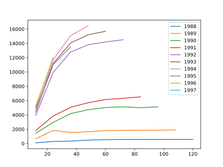
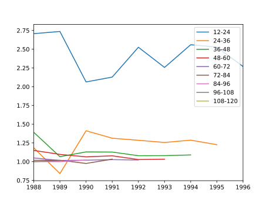

Recently I was trying to implement a simple chain ladder model in Python. I had tried
this a few years back when my skills were not as... skilled. Back then I knew there was
a chain ladder library for R, but when I tried searching for a similar package in
Python, I found nothing notable.

I hadn't approached the problem for a while until a few months back when out of interest
I searched again. I found an excellent module developed by a GitHub user by the name of
[JBogaardt](https://github.com/jbogaardt). It seems to be a passion project of his
because he is consistently working on and developing it by himself.

> [https://chainladder-python.readthedocs.io/en/latest/index.html](https://chainladder-python.readthedocs.io/en/latest/index.html)
> You can view the documentation here

What's great is that it aims to be compatible with the Pandas and Scikit-Learn APIs.
This means that if you are used to using either of these modules you'll quickly grasp
_chainladder_. Further, if you are a fan of sklearn pipelines, then you can easily
incorporate _chainladder_ into your pipelines, as I will show below.

There is some good documentation available in the docs, but I figured I'd write a bit of
an introductory guide here too to demonstrate its power.

## The Use Case -- Calculating IBNR for an Insurer

To demonstrate some of the abilities of _chainladder_ we will be calculating the IBNR
for an insurer across six lines of business, using a blend of the loss ratio and Cape
Cod methods.

(As a note, this post assumes prior knowledge of short-term actuarial reserving. Also, I
won't be worrying about the quality of the reserving; the methods are purely for
demonstration.)

### Loading the data

We will use a dataset made up of claims data from 376 US insurance groups. This dataset
is commonly used in research and is built into _chainladder_. You may recognize it as
_Schedule P_ data from the Casualty Actuarial society.

The data is already triangulated for us and in the format required by _chainladder_.
_chainladder_ has a **Triangle** class that is the required format for its methods. I
will explain how the **Triangle** class works after I load the data.

```python
import chainladder as cl
import pandas as pd

data = cl.load_sample('clrd')
data
```

<table border="1" class="dataframe">
  <thead>
    <tr style="text-align: right;">
      <th></th>
      <th>Triangle Summary</th>
    </tr>
  </thead>
  <tbody>
    <tr>
      <th>Valuation:</th>
      <td>1997-12</td>
    </tr>
    <tr>
      <th>Grain:</th>
      <td>OYDY</td>
    </tr>
    <tr>
      <th>Shape:</th>
      <td>(775, 6, 10, 10)</td>
    </tr>
    <tr>
      <th>Index:</th>
      <td>[GRNAME, LOB]</td>
    </tr>
    <tr>
      <th>Columns:</th>
      <td>[IncurLoss, CumPaidLoss, BulkLoss, EarnedPremDIR, EarnedPremCeded, EarnedPremNet]</td>
    </tr>
  </tbody>
</table>

This is a summary of the triangle data. It gives us a high level snapshot of all the
pertinent details.

**Valuation** tells us the valuation date of the data, in this case December 1997.

The **Grain** is the granularity of our triangle. This data is loaded by default on an
**O**rigin **Y**ear **D**evelopment **Y**ear basis (OYDY), but it can be loaded with
another grain. We can also easily change grains between monthly, quarterly and annually.

The **Shape** is the same as the shape we are familiar with from _pandas_. You will note
the shape of the triangle is four dimensional. This might sound strange, since the
triangles we are familiar with are two dimensional. But part of the power of the
_chainladder_ Triangle data type, is that it allows us to work with _multiple triangle
at once_. The first two items of the shape tuple tell us the number of rows and columns
our set has, and the last two tell us the number of origin periods and development
periods we have.

If we were to visualise the triangle, it would look something like this:

<div>
<style scoped>
    .dataframe tbody tr th:only-of-type {
        vertical-align: middle;
    }

    .dataframe tbody tr th {
        vertical-align: top;
    }

    .dataframe thead th {
        text-align: right;
    }

</style>
<table border="1" class="dataframe">
  <thead>
    <tr style="text-align: right;">
      <th></th>
      <th>Column 1</th>
      <th>Column 2</th>
      <th>...</th>
      <th>Column 6</th>
    </tr>
  </thead>
  <tbody>
    <tr>
      <th>1</th>
      <td>triangle(1, 1)</td>
      <td>triangle(1, 2)</td>
      <td>...</td>
      <td>triangle(1, 6)</td>
    </tr>
    <tr>
      <th>2</th>
      <td>triangle(2, 1)</td>
      <td>triangle(2, 2)</td>
      <td>...</td>
      <td>triangle(2, 6)</td>
    </tr>
    <tr>
      <th>...</th>
      <td>...</td>
      <td>...</td>
      <td>...</td>
      <td>...</td>
    </tr>
    <tr>
      <th>775</th>
      <td>triangle(775, 1)</td>
      <td>triangle(775, 2)</td>
      <td>...</td>
      <td>triangle(775, 6)</td>
    </tr>
  </tbody>
</table>
</div>

So each cell of our dataframe is itself a 2-dimensional triangle with 10 origin periods
and 10 development periods.

Now, let's look at **Index** and **Columns** to complete our understanding of the
Triangle data type.

We have a multi-level index. The first level for this dataset is _GRNAME_ which is the
name of the insurance group. The second level is _LOB_; the line of business. For each
insurance group, we have claims data for each line of business the group writes.
Finally, we have the **Columns**. This is telling us for each _GRNAME_ and _LOB_, we
have a triangulation of each column. Let's revisit the visualisation, but this time
allowing for **Index** and **Columns**:

<div>
<style scoped>
    .dataframe tbody tr th:only-of-type {
        vertical-align: middle;
    }

    .dataframe tbody tr th {
        vertical-align: top;
    }

    .dataframe thead th {
        text-align: right;
    }

</style>
<table border="1" class="dataframe">
  <thead>
    <tr style="text-align: right;">
      <th></th>
      <th>IncurLoss</th>
      <th>CumPaidLoss</th>
      <th>...</th>
      <th>EarnedPremNet</th>
    </tr>
  </thead>
  <tbody>
    <tr>
      <th>(Adriatic Ins Co, othliab)</th>
      <td>triangle(1, 1)</td>
      <td>triangle(1, 2)</td>
      <td>...</td>
      <td>triangle(1, 6)</td>
    </tr>
    <tr>
      <th>(Adriatic Ins Co, ppauto)</th>
      <td>triangle(2, 1)</td>
      <td>triangle(2, 2)</td>
      <td>...</td>
      <td>triangle(2, 6)</td>
    </tr>
    <tr>
      <th>...</th>
      <td>...</td>
      <td>...</td>
      <td>...</td>
      <td>...</td>
    </tr>
    <tr>
      <th>(Zurich Ins (Guam) Inc, wkcomp)</th>
      <td>triangle(775, 1)</td>
      <td>triangle(775, 2)</td>
      <td>...</td>
      <td>triangle(775, 6)</td>
    </tr>
  </tbody>
</table>
</div>

Now, let's zoom into one of the triangles, say the cumulative paid losses
(_CumPaidLoss_) for the Workmen's Compensation line of business (_wkcomp_) line of
business for _Allstate Ins Co Grp_:

```python
data.loc[('Allstate Ins Co Grp', 'wkcomp'), 'CumPaidLoss']
```

<table border="1" class="dataframe">
  <thead>
    <tr style="text-align: right;">
      <th></th>
      <th>12</th>
      <th>24</th>
      <th>36</th>
      <th>48</th>
      <th>60</th>
      <th>72</th>
      <th>84</th>
      <th>96</th>
      <th>108</th>
      <th>120</th>
    </tr>
  </thead>
  <tbody>
    <tr>
      <th>1988</th>
      <td>70,571</td>
      <td>155,905</td>
      <td>220,744</td>
      <td>251,595</td>
      <td>274,156</td>
      <td>287,676</td>
      <td>298,499</td>
      <td>304,873</td>
      <td>321,808</td>
      <td>325,322</td>
    </tr>
    <tr>
      <th>1989</th>
      <td>66,547</td>
      <td>136,447</td>
      <td>179,142</td>
      <td>211,343</td>
      <td>231,430</td>
      <td>244,750</td>
      <td>254,557</td>
      <td>270,059</td>
      <td>273,873</td>
      <td>NaN</td>
    </tr>
    <tr>
      <th>1990</th>
      <td>52,233</td>
      <td>133,370</td>
      <td>178,444</td>
      <td>204,442</td>
      <td>222,193</td>
      <td>232,940</td>
      <td>253,337</td>
      <td>256,788</td>
      <td>NaN</td>
      <td>NaN</td>
    </tr>
    <tr>
      <th>1991</th>
      <td>59,315</td>
      <td>128,051</td>
      <td>169,793</td>
      <td>196,685</td>
      <td>213,165</td>
      <td>234,676</td>
      <td>239,195</td>
      <td>NaN</td>
      <td>NaN</td>
      <td>NaN</td>
    </tr>
    <tr>
      <th>1992</th>
      <td>39,991</td>
      <td>89,873</td>
      <td>114,117</td>
      <td>133,003</td>
      <td>154,362</td>
      <td>159,496</td>
      <td>NaN</td>
      <td>NaN</td>
      <td>NaN</td>
      <td>NaN</td>
    </tr>
    <tr>
      <th>1993</th>
      <td>19,744</td>
      <td>47,229</td>
      <td>61,909</td>
      <td>85,099</td>
      <td>87,215</td>
      <td>NaN</td>
      <td>NaN</td>
      <td>NaN</td>
      <td>NaN</td>
      <td>NaN</td>
    </tr>
    <tr>
      <th>1994</th>
      <td>20,379</td>
      <td>46,773</td>
      <td>88,636</td>
      <td>91,077</td>
      <td>NaN</td>
      <td>NaN</td>
      <td>NaN</td>
      <td>NaN</td>
      <td>NaN</td>
      <td>NaN</td>
    </tr>
    <tr>
      <th>1995</th>
      <td>18,756</td>
      <td>84,712</td>
      <td>87,311</td>
      <td>NaN</td>
      <td>NaN</td>
      <td>NaN</td>
      <td>NaN</td>
      <td>NaN</td>
      <td>NaN</td>
      <td>NaN</td>
    </tr>
    <tr>
      <th>1996</th>
      <td>42,609</td>
      <td>44,916</td>
      <td>NaN</td>
      <td>NaN</td>
      <td>NaN</td>
      <td>NaN</td>
      <td>NaN</td>
      <td>NaN</td>
      <td>NaN</td>
      <td>NaN</td>
    </tr>
    <tr>
      <th>1997</th>
      <td>691</td>
      <td>NaN</td>
      <td>NaN</td>
      <td>NaN</td>
      <td>NaN</td>
      <td>NaN</td>
      <td>NaN</td>
      <td>NaN</td>
      <td>NaN</td>
      <td>NaN</td>
    </tr>
  </tbody>
</table>

And there is the triangle we are familiar with! We have 775 * 6 = 4 650 of these in our
data, all easily accessible using *pandas\* style indexing.

Okay, so that is actually a lot of data, and it is a bit overwhelming. Let's just focus
on one insurance group, _National American Ins Co_. And the only columns we really care
about for now are _CumPaidLoss_ and _EarnedPremDIR_.

```python
naic = data.loc['National American Ins Co', ['CumPaidLoss', 'EarnedPremDIR']]
naic
```

<table border="1" class="dataframe">
  <thead>
    <tr style="text-align: right;">
      <th></th>
      <th>Triangle Summary</th>
    </tr>
  </thead>
  <tbody>
    <tr>
      <th>Valuation:</th>
      <td>1997-12</td>
    </tr>
    <tr>
      <th>Grain:</th>
      <td>OYDY</td>
    </tr>
    <tr>
      <th>Shape:</th>
      <td>(6, 2, 10, 10)</td>
    </tr>
    <tr>
      <th>Index:</th>
      <td>[LOB]</td>
    </tr>
    <tr>
      <th>Columns:</th>
      <td>[CumPaidLoss, EarnedPremDIR]</td>
    </tr>
  </tbody>
</table>

This is the data we will work with. It has only one index now, _LOB_, because we
selected only one group. And only two columns, the cumulative paid loss and earned
premium.

## Useful methods of the Triangle class

**Triangle**'s have a number of useful built in methods to make working with them
easier. Let's focus on Cumulative Claims Paid for Workmens Compensation for these
examples just to simplify some of the indexing.

```python
wkcomp = naic.loc['wkcomp', 'CumPaidLoss']
wkcomp
```

<table border="1" class="dataframe">
  <thead>
    <tr style="text-align: right;">
      <th></th>
      <th>12</th>
      <th>24</th>
      <th>36</th>
      <th>48</th>
      <th>60</th>
      <th>72</th>
      <th>84</th>
      <th>96</th>
      <th>108</th>
      <th>120</th>
    </tr>
  </thead>
  <tbody>
    <tr>
      <th>1988</th>
      <td>106</td>
      <td>287</td>
      <td>340</td>
      <td>473</td>
      <td>544</td>
      <td>571</td>
      <td>581</td>
      <td>581</td>
      <td>581</td>
      <td>581</td>
    </tr>
    <tr>
      <th>1989</th>
      <td>672</td>
      <td>1,839</td>
      <td>1,547</td>
      <td>1,650</td>
      <td>1,810</td>
      <td>1,838</td>
      <td>1,872</td>
      <td>1,872</td>
      <td>1,897</td>
      <td>NaN</td>
    </tr>
    <tr>
      <th>1990</th>
      <td>1,436</td>
      <td>2,963</td>
      <td>4,184</td>
      <td>4,728</td>
      <td>5,033</td>
      <td>5,134</td>
      <td>5,011</td>
      <td>5,120</td>
      <td>NaN</td>
      <td>NaN</td>
    </tr>
    <tr>
      <th>1991</th>
      <td>1,810</td>
      <td>3,852</td>
      <td>5,056</td>
      <td>5,703</td>
      <td>6,148</td>
      <td>6,313</td>
      <td>6,526</td>
      <td>NaN</td>
      <td>NaN</td>
      <td>NaN</td>
    </tr>
    <tr>
      <th>1992</th>
      <td>3,938</td>
      <td>9,948</td>
      <td>12,783</td>
      <td>13,800</td>
      <td>14,195</td>
      <td>14,509</td>
      <td>NaN</td>
      <td>NaN</td>
      <td>NaN</td>
      <td>NaN</td>
    </tr>
    <tr>
      <th>1993</th>
      <td>4,961</td>
      <td>11,196</td>
      <td>14,062</td>
      <td>15,193</td>
      <td>15,696</td>
      <td>NaN</td>
      <td>NaN</td>
      <td>NaN</td>
      <td>NaN</td>
      <td>NaN</td>
    </tr>
    <tr>
      <th>1994</th>
      <td>4,581</td>
      <td>11,727</td>
      <td>15,090</td>
      <td>16,442</td>
      <td>NaN</td>
      <td>NaN</td>
      <td>NaN</td>
      <td>NaN</td>
      <td>NaN</td>
      <td>NaN</td>
    </tr>
    <tr>
      <th>1995</th>
      <td>4,364</td>
      <td>11,029</td>
      <td>13,526</td>
      <td>NaN</td>
      <td>NaN</td>
      <td>NaN</td>
      <td>NaN</td>
      <td>NaN</td>
      <td>NaN</td>
      <td>NaN</td>
    </tr>
    <tr>
      <th>1996</th>
      <td>5,295</td>
      <td>12,017</td>
      <td>NaN</td>
      <td>NaN</td>
      <td>NaN</td>
      <td>NaN</td>
      <td>NaN</td>
      <td>NaN</td>
      <td>NaN</td>
      <td>NaN</td>
    </tr>
    <tr>
      <th>1997</th>
      <td>6,478</td>
      <td>NaN</td>
      <td>NaN</td>
      <td>NaN</td>
      <td>NaN</td>
      <td>NaN</td>
      <td>NaN</td>
      <td>NaN</td>
      <td>NaN</td>
      <td>NaN</td>
    </tr>
  </tbody>
</table>

The Triangle class gives us quick access to many useful methods. We can easily convert
from cumulative to incremental, and back:

```python
wkcomp.cum_to_incr()
```

<table border="1" class="dataframe">
  <thead>
    <tr style="text-align: right;">
      <th></th>
      <th>12</th>
      <th>24</th>
      <th>36</th>
      <th>48</th>
      <th>60</th>
      <th>72</th>
      <th>84</th>
      <th>96</th>
      <th>108</th>
      <th>120</th>
    </tr>
  </thead>
  <tbody>
    <tr>
      <th>1988</th>
      <td>106</td>
      <td>181</td>
      <td>53</td>
      <td>133</td>
      <td>71</td>
      <td>27</td>
      <td>10</td>
      <td>NaN</td>
      <td>NaN</td>
      <td>NaN</td>
    </tr>
    <tr>
      <th>1989</th>
      <td>672</td>
      <td>1,167</td>
      <td>-292</td>
      <td>103</td>
      <td>160</td>
      <td>28</td>
      <td>34</td>
      <td>NaN</td>
      <td>25</td>
      <td>NaN</td>
    </tr>
    <tr>
      <th>1990</th>
      <td>1,436</td>
      <td>1,527</td>
      <td>1,221</td>
      <td>544</td>
      <td>305</td>
      <td>101</td>
      <td>-123</td>
      <td>109</td>
      <td>NaN</td>
      <td>NaN</td>
    </tr>
    <tr>
      <th>1991</th>
      <td>1,810</td>
      <td>2,042</td>
      <td>1,204</td>
      <td>647</td>
      <td>445</td>
      <td>165</td>
      <td>213</td>
      <td>NaN</td>
      <td>NaN</td>
      <td>NaN</td>
    </tr>
    <tr>
      <th>1992</th>
      <td>3,938</td>
      <td>6,010</td>
      <td>2,835</td>
      <td>1,017</td>
      <td>395</td>
      <td>314</td>
      <td>NaN</td>
      <td>NaN</td>
      <td>NaN</td>
      <td>NaN</td>
    </tr>
    <tr>
      <th>1993</th>
      <td>4,961</td>
      <td>6,235</td>
      <td>2,866</td>
      <td>1,131</td>
      <td>503</td>
      <td>NaN</td>
      <td>NaN</td>
      <td>NaN</td>
      <td>NaN</td>
      <td>NaN</td>
    </tr>
    <tr>
      <th>1994</th>
      <td>4,581</td>
      <td>7,146</td>
      <td>3,363</td>
      <td>1,352</td>
      <td>NaN</td>
      <td>NaN</td>
      <td>NaN</td>
      <td>NaN</td>
      <td>NaN</td>
      <td>NaN</td>
    </tr>
    <tr>
      <th>1995</th>
      <td>4,364</td>
      <td>6,665</td>
      <td>2,497</td>
      <td>NaN</td>
      <td>NaN</td>
      <td>NaN</td>
      <td>NaN</td>
      <td>NaN</td>
      <td>NaN</td>
      <td>NaN</td>
    </tr>
    <tr>
      <th>1996</th>
      <td>5,295</td>
      <td>6,722</td>
      <td>NaN</td>
      <td>NaN</td>
      <td>NaN</td>
      <td>NaN</td>
      <td>NaN</td>
      <td>NaN</td>
      <td>NaN</td>
      <td>NaN</td>
    </tr>
    <tr>
      <th>1997</th>
      <td>6,478</td>
      <td>NaN</td>
      <td>NaN</td>
      <td>NaN</td>
      <td>NaN</td>
      <td>NaN</td>
      <td>NaN</td>
      <td>NaN</td>
      <td>NaN</td>
      <td>NaN</td>
    </tr>
  </tbody>
</table>

We can quickly get development factors for each cell of the triangle

```python
wkcomp.link_ratio
```

<table border="1" class="dataframe">
  <thead>
    <tr style="text-align: right;">
      <th></th>
      <th>12-24</th>
      <th>24-36</th>
      <th>36-48</th>
      <th>48-60</th>
      <th>60-72</th>
      <th>72-84</th>
      <th>84-96</th>
      <th>96-108</th>
      <th>108-120</th>
    </tr>
  </thead>
  <tbody>
    <tr>
      <th>1988</th>
      <td>2.7075</td>
      <td>1.1847</td>
      <td>1.3912</td>
      <td>1.1501</td>
      <td>1.0496</td>
      <td>1.0175</td>
      <td>1.0000</td>
      <td>1.0000</td>
      <td>1.0000</td>
    </tr>
    <tr>
      <th>1989</th>
      <td>2.7366</td>
      <td>0.8412</td>
      <td>1.0666</td>
      <td>1.0970</td>
      <td>1.0155</td>
      <td>1.0185</td>
      <td>1.0000</td>
      <td>1.0134</td>
      <td>NaN</td>
    </tr>
    <tr>
      <th>1990</th>
      <td>2.0634</td>
      <td>1.4121</td>
      <td>1.1300</td>
      <td>1.0645</td>
      <td>1.0201</td>
      <td>0.9760</td>
      <td>1.0218</td>
      <td>NaN</td>
      <td>NaN</td>
    </tr>
    <tr>
      <th>1991</th>
      <td>2.1282</td>
      <td>1.3126</td>
      <td>1.1280</td>
      <td>1.0780</td>
      <td>1.0268</td>
      <td>1.0337</td>
      <td>NaN</td>
      <td>NaN</td>
      <td>NaN</td>
    </tr>
    <tr>
      <th>1992</th>
      <td>2.5262</td>
      <td>1.2850</td>
      <td>1.0796</td>
      <td>1.0286</td>
      <td>1.0221</td>
      <td>NaN</td>
      <td>NaN</td>
      <td>NaN</td>
      <td>NaN</td>
    </tr>
    <tr>
      <th>1993</th>
      <td>2.2568</td>
      <td>1.2560</td>
      <td>1.0804</td>
      <td>1.0331</td>
      <td>NaN</td>
      <td>NaN</td>
      <td>NaN</td>
      <td>NaN</td>
      <td>NaN</td>
    </tr>
    <tr>
      <th>1994</th>
      <td>2.5599</td>
      <td>1.2868</td>
      <td>1.0896</td>
      <td>NaN</td>
      <td>NaN</td>
      <td>NaN</td>
      <td>NaN</td>
      <td>NaN</td>
      <td>NaN</td>
    </tr>
    <tr>
      <th>1995</th>
      <td>2.5273</td>
      <td>1.2264</td>
      <td>NaN</td>
      <td>NaN</td>
      <td>NaN</td>
      <td>NaN</td>
      <td>NaN</td>
      <td>NaN</td>
      <td>NaN</td>
    </tr>
    <tr>
      <th>1996</th>
      <td>2.2695</td>
      <td>NaN</td>
      <td>NaN</td>
      <td>NaN</td>
      <td>NaN</td>
      <td>NaN</td>
      <td>NaN</td>
      <td>NaN</td>
      <td>NaN</td>
    </tr>
  </tbody>
</table>

And because the API is similar to _pandas_, we can also plot very easily

```python
wkcomp.T.plot()
```



```python
wkcomp.link_ratio.plot()
```



There are numerous other methods and I urge you to explore them in the documentation, or
just while playing around with the data in a jupyter workbook.

## Using basic chain ladder to calculate IBNR

Now, since we have our triangle, the next step is to apply good old chain ladder. In a
standard actuarial workflow, this normally involves a bit of Excel work where we
calculate development factors and multiply it out to get our ultimate claims figures. We
then subtract the latest developments to get our IBNR portion. It is not terribly
difficult if we have standardised workbooks, but there is always some issue that pops
up. Not to mention, without really stringent workbook controls, Excel is a very
uncontrolled environment prone to human error and operational error. I am sure we have
all experienced the darker side of Excel (usually late at night before a deadline).

With chainladder things are a lot easier:

```python
bcl = cl.Chainladder().fit(naic)
```

And that's pretty much it.

Okay, I am oversimplifying things. But, technically, that one line applied a basic chain
ladder to every line of business. We can get an IBNR for our insurance group with the
following line:

```python
bcl.ibnr_['CumPaidLoss'].sum()
```

<table border="1" class="dataframe">
  <thead>
    <tr style="text-align: right;">
      <th></th>
      <th>2261</th>
    </tr>
  </thead>
  <tbody>
    <tr>
      <th>1988</th>
      <td>NaN</td>
    </tr>
    <tr>
      <th>1989</th>
      <td>161</td>
    </tr>
    <tr>
      <th>1990</th>
      <td>392</td>
    </tr>
    <tr>
      <th>1991</th>
      <td>592</td>
    </tr>
    <tr>
      <th>1992</th>
      <td>761</td>
    </tr>
    <tr>
      <th>1993</th>
      <td>1,037</td>
    </tr>
    <tr>
      <th>1994</th>
      <td>1,861</td>
    </tr>
    <tr>
      <th>1995</th>
      <td>4,130</td>
    </tr>
    <tr>
      <th>1996</th>
      <td>10,857</td>
    </tr>
    <tr>
      <th>1997</th>
      <td>30,653</td>
    </tr>
  </tbody>
</table>

Let's focus on Workmens Compensation again. We can see the full triangle expectation, as
well as back fit the chain ladder to get a full expected triangle:

### Full triangle

```python
bcl.full_triangle_.loc['wkcomp', 'CumPaidLoss']
```

<table border="1" class="dataframe">
  <thead>
    <tr style="text-align: right;">
      <th></th>
      <th>12</th>
      <th>24</th>
      <th>36</th>
      <th>48</th>
      <th>60</th>
      <th>72</th>
      <th>84</th>
      <th>96</th>
      <th>108</th>
      <th>120</th>
      <th>132</th>
      <th>9999</th>
    </tr>
  </thead>
  <tbody>
    <tr>
      <th>1988</th>
      <td>106</td>
      <td>287</td>
      <td>340</td>
      <td>473</td>
      <td>544</td>
      <td>571</td>
      <td>581</td>
      <td>581</td>
      <td>581</td>
      <td>581</td>
      <td>581</td>
      <td>581</td>
    </tr>
    <tr>
      <th>1989</th>
      <td>672</td>
      <td>1,839</td>
      <td>1,547</td>
      <td>1,650</td>
      <td>1,810</td>
      <td>1,838</td>
      <td>1,872</td>
      <td>1,872</td>
      <td>1,897</td>
      <td>1,897</td>
      <td>1,897</td>
      <td>1,897</td>
    </tr>
    <tr>
      <th>1990</th>
      <td>1,436</td>
      <td>2,963</td>
      <td>4,184</td>
      <td>4,728</td>
      <td>5,033</td>
      <td>5,134</td>
      <td>5,011</td>
      <td>5,120</td>
      <td>5,172</td>
      <td>5,172</td>
      <td>5,172</td>
      <td>5,172</td>
    </tr>
    <tr>
      <th>1991</th>
      <td>1,810</td>
      <td>3,852</td>
      <td>5,056</td>
      <td>5,703</td>
      <td>6,148</td>
      <td>6,313</td>
      <td>6,526</td>
      <td>6,621</td>
      <td>6,689</td>
      <td>6,689</td>
      <td>6,689</td>
      <td>6,689</td>
    </tr>
    <tr>
      <th>1992</th>
      <td>3,938</td>
      <td>9,948</td>
      <td>12,783</td>
      <td>13,800</td>
      <td>14,195</td>
      <td>14,509</td>
      <td>14,649</td>
      <td>14,863</td>
      <td>15,015</td>
      <td>15,015</td>
      <td>15,015</td>
      <td>15,015</td>
    </tr>
    <tr>
      <th>1993</th>
      <td>4,961</td>
      <td>11,196</td>
      <td>14,062</td>
      <td>15,193</td>
      <td>15,696</td>
      <td>16,055</td>
      <td>16,211</td>
      <td>16,447</td>
      <td>16,615</td>
      <td>16,615</td>
      <td>16,615</td>
      <td>16,615</td>
    </tr>
    <tr>
      <th>1994</th>
      <td>4,581</td>
      <td>11,727</td>
      <td>15,090</td>
      <td>16,442</td>
      <td>17,186</td>
      <td>17,579</td>
      <td>17,749</td>
      <td>18,008</td>
      <td>18,192</td>
      <td>18,192</td>
      <td>18,192</td>
      <td>18,192</td>
    </tr>
    <tr>
      <th>1995</th>
      <td>4,364</td>
      <td>11,029</td>
      <td>13,526</td>
      <td>14,782</td>
      <td>15,450</td>
      <td>15,804</td>
      <td>15,957</td>
      <td>16,190</td>
      <td>16,355</td>
      <td>16,355</td>
      <td>16,355</td>
      <td>16,355</td>
    </tr>
    <tr>
      <th>1996</th>
      <td>5,295</td>
      <td>12,017</td>
      <td>15,143</td>
      <td>16,549</td>
      <td>17,298</td>
      <td>17,694</td>
      <td>17,865</td>
      <td>18,126</td>
      <td>18,311</td>
      <td>18,311</td>
      <td>18,311</td>
      <td>18,311</td>
    </tr>
    <tr>
      <th>1997</th>
      <td>6,478</td>
      <td>15,468</td>
      <td>19,492</td>
      <td>21,302</td>
      <td>22,265</td>
      <td>22,775</td>
      <td>22,995</td>
      <td>23,331</td>
      <td>23,569</td>
      <td>23,569</td>
      <td>23,569</td>
      <td>23,569</td>
    </tr>
  </tbody>
</table>

### Backfit

```python
bcl.full_expectation_.loc['wkcomp', 'CumPaidLoss']
```

<table border="1" class="dataframe">
  <thead>
    <tr style="text-align: right;">
      <th></th>
      <th>12</th>
      <th>24</th>
      <th>36</th>
      <th>48</th>
      <th>60</th>
      <th>72</th>
      <th>84</th>
      <th>96</th>
      <th>108</th>
      <th>120</th>
      <th>132</th>
      <th>9999</th>
    </tr>
  </thead>
  <tbody>
    <tr>
      <th>1988</th>
      <td>160</td>
      <td>381</td>
      <td>480</td>
      <td>525</td>
      <td>549</td>
      <td>561</td>
      <td>567</td>
      <td>575</td>
      <td>581</td>
      <td>581</td>
      <td>581</td>
      <td>581</td>
    </tr>
    <tr>
      <th>1989</th>
      <td>521</td>
      <td>1,245</td>
      <td>1,569</td>
      <td>1,715</td>
      <td>1,792</td>
      <td>1,833</td>
      <td>1,851</td>
      <td>1,878</td>
      <td>1,897</td>
      <td>1,897</td>
      <td>1,897</td>
      <td>1,897</td>
    </tr>
    <tr>
      <th>1990</th>
      <td>1,422</td>
      <td>3,394</td>
      <td>4,277</td>
      <td>4,675</td>
      <td>4,886</td>
      <td>4,998</td>
      <td>5,046</td>
      <td>5,120</td>
      <td>5,172</td>
      <td>5,172</td>
      <td>5,172</td>
      <td>5,172</td>
    </tr>
    <tr>
      <th>1991</th>
      <td>1,838</td>
      <td>4,390</td>
      <td>5,532</td>
      <td>6,045</td>
      <td>6,319</td>
      <td>6,463</td>
      <td>6,526</td>
      <td>6,621</td>
      <td>6,689</td>
      <td>6,689</td>
      <td>6,689</td>
      <td>6,689</td>
    </tr>
    <tr>
      <th>1992</th>
      <td>4,127</td>
      <td>9,854</td>
      <td>12,417</td>
      <td>13,570</td>
      <td>14,184</td>
      <td>14,509</td>
      <td>14,649</td>
      <td>14,863</td>
      <td>15,015</td>
      <td>15,015</td>
      <td>15,015</td>
      <td>15,015</td>
    </tr>
    <tr>
      <th>1993</th>
      <td>4,567</td>
      <td>10,904</td>
      <td>13,741</td>
      <td>15,017</td>
      <td>15,696</td>
      <td>16,055</td>
      <td>16,211</td>
      <td>16,447</td>
      <td>16,615</td>
      <td>16,615</td>
      <td>16,615</td>
      <td>16,615</td>
    </tr>
    <tr>
      <th>1994</th>
      <td>5,000</td>
      <td>11,939</td>
      <td>15,045</td>
      <td>16,442</td>
      <td>17,186</td>
      <td>17,579</td>
      <td>17,749</td>
      <td>18,008</td>
      <td>18,192</td>
      <td>18,192</td>
      <td>18,192</td>
      <td>18,192</td>
    </tr>
    <tr>
      <th>1995</th>
      <td>4,495</td>
      <td>10,734</td>
      <td>13,526</td>
      <td>14,782</td>
      <td>15,450</td>
      <td>15,804</td>
      <td>15,957</td>
      <td>16,190</td>
      <td>16,355</td>
      <td>16,355</td>
      <td>16,355</td>
      <td>16,355</td>
    </tr>
    <tr>
      <th>1996</th>
      <td>5,033</td>
      <td>12,017</td>
      <td>15,143</td>
      <td>16,549</td>
      <td>17,298</td>
      <td>17,694</td>
      <td>17,865</td>
      <td>18,126</td>
      <td>18,311</td>
      <td>18,311</td>
      <td>18,311</td>
      <td>18,311</td>
    </tr>
    <tr>
      <th>1997</th>
      <td>6,478</td>
      <td>15,468</td>
      <td>19,492</td>
      <td>21,302</td>
      <td>22,265</td>
      <td>22,775</td>
      <td>22,995</td>
      <td>23,331</td>
      <td>23,569</td>
      <td>23,569</td>
      <td>23,569</td>
      <td>23,569</td>
    </tr>
  </tbody>
</table>

We can also see development factors:

### Cumulative development factors

```python
bcl.cdf_.loc['wkcomp', 'CumPaidLoss']
```

<table border="1" class="dataframe">
  <thead>
    <tr style="text-align: right;">
      <th></th>
      <th>12-Ult</th>
      <th>24-Ult</th>
      <th>36-Ult</th>
      <th>48-Ult</th>
      <th>60-Ult</th>
      <th>72-Ult</th>
      <th>84-Ult</th>
      <th>96-Ult</th>
      <th>108-Ult</th>
      <th>120-Ult</th>
      <th>132-Ult</th>
    </tr>
  </thead>
  <tbody>
    <tr>
      <th>(All)</th>
      <td>3.6383</td>
      <td>1.5237</td>
      <td>1.2092</td>
      <td>1.1064</td>
      <td>1.0586</td>
      <td>1.0349</td>
      <td>1.0249</td>
      <td>1.0102</td>
      <td>1.0000</td>
      <td>1.0000</td>
      <td>1.0000</td>
    </tr>
  </tbody>
</table>

### Incremental development factors

```python
bcl.ldf_.loc['wkcomp', 'CumPaidLoss']
```

<table border="1" class="dataframe">
  <thead>
    <tr style="text-align: right;">
      <th></th>
      <th>12-24</th>
      <th>24-36</th>
      <th>36-48</th>
      <th>48-60</th>
      <th>60-72</th>
      <th>72-84</th>
      <th>84-96</th>
      <th>96-108</th>
      <th>108-120</th>
      <th>120-132</th>
      <th>132-144</th>
    </tr>
  </thead>
  <tbody>
    <tr>
      <th>(All)</th>
      <td>2.3877</td>
      <td>1.2602</td>
      <td>1.0929</td>
      <td>1.0452</td>
      <td>1.0229</td>
      <td>1.0097</td>
      <td>1.0146</td>
      <td>1.0102</td>
      <td>1.0000</td>
      <td>1.0000</td>
      <td>1.0000</td>
    </tr>
  </tbody>
</table>

As you can see, _chainladder_ adopts the _sklearn_ API. If you can use _sklearn_, you
can use _chainladder_.

## Creating a simple reserving algorithm

Now, simply fitting a basic chain ladder is not always appropriate. We need to consider
the sparsity of the triangle. Where there is too little data to use chain ladder based
methods we will use the loss ratio approach. For other cases we will use the Cape Cod
approach.

So how do we go about this? Well first, we need an indicator to tell us if the triangle
is too sparse to apply chain ladder based methods.

If we convert non zero cells in the triangle to 1, we can compare the sum to the number
of elements. If the sum is above a certain threshold we can say that it is too sparse
and apply out simple loss ratio based approach.

### Indicator for non zero elements

```python
# n_cells is hardcoded for example purposes but should be derived in
# real world workflow
def get_sparsity(triangle, n_cells=55):
    indicator = triangle.unstack() / triangle.unstack()
    density = indicator.sum() / n_cells
    return 1 - density

get_sparsity(naic.loc['prodliab', 'CumPaidLoss'])
```

```
0.8363636363636364
```

So what threshold should be chosen? That's quite subjective. So let's just pick 25%, and
go with that. Now, if a triangle has more than 25% sparsity, it means that 25% of the
cells have no data. In a cumulative triangle, that is a lot (in my subjective opinion).

Now if a triangle is sparse, we want to apply the loss ratio. chainladder does not have
a loss ratio method built in (and why would it?). It is not too difficult to create one,
but for brevity we will just make a function that returns the IBNR based on a given loss
ratio applied for a given number of years.

```python
def loss_ratio_ibnr(triangle, earned_premium, loss_ratio, from_year):

    earned_premium = earned_premium.to_frame()
    earned_premium.columns = ['IBNR']
    earned_premium['IBNR'] = loss_ratio * earned_premium

    latest_paid = triangle.latest_diagonal.to_frame()
    latest_paid.columns = ['IBNR']

    ibnr = earned_premium[['IBNR']] - latest_paid

    ibnr.loc[ibnr.index.year < from_year, 'IBNR'] = 0

    return ibnr

loss_ratio_ibnr(
    naic.loc['prodliab', 'CumPaidLoss'],
    naic.loc['prodliab', 'EarnedPremDIR'].latest_diagonal,
    0.5,
    1995
)
```

<div>
<style scoped>
    .dataframe tbody tr th:only-of-type {
        vertical-align: middle;
    }

    .dataframe tbody tr th {
        vertical-align: top;
    }

    .dataframe thead th {
        text-align: right;
    }

</style>
<table border="1" class="dataframe">
  <thead>
    <tr style="text-align: right;">
      <th></th>
      <th>IBNR</th>
    </tr>
  </thead>
  <tbody>
    <tr>
      <th>1988</th>
      <td>0.0</td>
    </tr>
    <tr>
      <th>1989</th>
      <td>0.0</td>
    </tr>
    <tr>
      <th>1990</th>
      <td>0.0</td>
    </tr>
    <tr>
      <th>1991</th>
      <td>0.0</td>
    </tr>
    <tr>
      <th>1992</th>
      <td>0.0</td>
    </tr>
    <tr>
      <th>1993</th>
      <td>0.0</td>
    </tr>
    <tr>
      <th>1994</th>
      <td>0.0</td>
    </tr>
    <tr>
      <th>1995</th>
      <td>281.0</td>
    </tr>
    <tr>
      <th>1996</th>
      <td>416.5</td>
    </tr>
    <tr>
      <th>1997</th>
      <td>770.0</td>
    </tr>
  </tbody>
</table>
</div>

Great, so we have a way to get an IBNR for sparse triangles. Now we can create a simple
reserving algorithm that uses loss ratio when the sparsity is above 25%, and Cape Cod
otherwise.

```python
def reserving_algorithm(triangle, sparsity_threshold):

    lobs = triangle['LOB'].to_numpy()
    ibnr_by_lob = {}

    for lob in lobs:

        claims = triangle.loc[lob, 'CumPaidLoss']
        premium = triangle.loc[lob, 'EarnedPremDIR'].latest_diagonal

        if get_sparsity(claims) >= 0.25:
            ibnr_by_lob[lob] = loss_ratio_ibnr(claims, premium, 1.0, 1995)
            ibnr_by_lob[lob].columns = ['Cape Cod']
        else:
            ibnr_by_lob[lob] = cl.CapeCod(decay=0.75).fit(
                claims,
                sample_weight=premium
            ).ibnr_.to_frame()
            ibnr_by_lob[lob].columns = ['Cape Cod']

    ibnr = pd.concat(ibnr_by_lob, axis=1)
    ibnr['Total'] = ibnr.sum(axis=1)

    return ibnr.fillna(0)
```

```python
reserving_algorithm(naic, 0.25)
```

<div>
<style scoped>
    .dataframe tbody tr th:only-of-type {
        vertical-align: middle;
    }

    .dataframe tbody tr th {
        vertical-align: top;
    }

    .dataframe thead tr th {
        text-align: left;
    }

</style>
<table border="1" class="dataframe">
  <thead>
    <tr>
      <th></th>
      <th>comauto</th>
      <th>medmal</th>
      <th>othliab</th>
      <th>ppauto</th>
      <th>prodliab</th>
      <th>wkcomp</th>
      <th>Total</th>
    </tr>
    <tr>
      <th></th>
      <th>Cape Cod</th>
      <th>Cape Cod</th>
      <th>Cape Cod</th>
      <th>Cape Cod</th>
      <th>Cape Cod</th>
      <th>Cape Cod</th>
      <th></th>
    </tr>
  </thead>
  <tbody>
    <tr>
      <th>1988</th>
      <td>0.000000</td>
      <td>0.0</td>
      <td>0.000000</td>
      <td>0.000000</td>
      <td>0.0</td>
      <td>0.000000</td>
      <td>0.000000</td>
    </tr>
    <tr>
      <th>1989</th>
      <td>199.700077</td>
      <td>0.0</td>
      <td>2.433665</td>
      <td>0.000000</td>
      <td>0.0</td>
      <td>0.000000</td>
      <td>202.133742</td>
    </tr>
    <tr>
      <th>1990</th>
      <td>374.176681</td>
      <td>0.0</td>
      <td>5.381205</td>
      <td>0.000000</td>
      <td>0.0</td>
      <td>113.670274</td>
      <td>493.228161</td>
    </tr>
    <tr>
      <th>1991</th>
      <td>384.622895</td>
      <td>0.0</td>
      <td>27.550540</td>
      <td>0.000000</td>
      <td>0.0</td>
      <td>404.705647</td>
      <td>816.879082</td>
    </tr>
    <tr>
      <th>1992</th>
      <td>294.215562</td>
      <td>0.0</td>
      <td>-41.698234</td>
      <td>0.189356</td>
      <td>0.0</td>
      <td>431.483501</td>
      <td>684.190186</td>
    </tr>
    <tr>
      <th>1993</th>
      <td>255.948328</td>
      <td>0.0</td>
      <td>-154.280465</td>
      <td>-0.430910</td>
      <td>0.0</td>
      <td>537.545822</td>
      <td>638.782775</td>
    </tr>
    <tr>
      <th>1994</th>
      <td>420.565099</td>
      <td>0.0</td>
      <td>-65.160634</td>
      <td>-253.447370</td>
      <td>0.0</td>
      <td>1280.055827</td>
      <td>1382.012922</td>
    </tr>
    <tr>
      <th>1995</th>
      <td>393.962604</td>
      <td>0.0</td>
      <td>474.803152</td>
      <td>-338.502120</td>
      <td>577.0</td>
      <td>2242.557573</td>
      <td>3349.821209</td>
    </tr>
    <tr>
      <th>1996</th>
      <td>979.192035</td>
      <td>0.0</td>
      <td>1570.368156</td>
      <td>1029.200060</td>
      <td>879.0</td>
      <td>5393.652281</td>
      <td>9851.412531</td>
    </tr>
    <tr>
      <th>1997</th>
      <td>2907.991561</td>
      <td>0.0</td>
      <td>3529.706847</td>
      <td>4076.591330</td>
      <td>1584.0</td>
      <td>11639.363016</td>
      <td>23737.652754</td>
    </tr>
  </tbody>
</table>

And there we have it, an (admittedly oversimplified) automated and repeatable reserving
algorithm. (Medmal is zero because the triangle is 100% sparse and there is no earned
premium).

I am focusing purely on the chainladder package and its usage, so let's ignore any
discussion around whether the reserving approach is correct or not. For the purpose of
demonstration it doesn't matter.

## Where do we go from here?

In the real world life isn't so simple. What I have shown is only a small part of the
reserving process, but I have demonstrated the usefulness of the chainladder package,
and how free open-source software can be extremely valuable in a commercial context. Its
not hard to imagine how this process can be extended in either direction and completely
automate the reserving process of an insurer.

For example, we started this process using clean, triangulated data. But in reality, you
get messy, tabular data from a system. So you would need to pull the data from the
system, push it through a cleaning process and then a preprocessing process, before it
would go into a more robust and complete version of the chainladder reserving process
we've built above. But, with the right skills this is achievable. It simply takes
investment of person-hours, which will save considerable person-hours in future.

After the chainladder process above, the results can be pushed to dashboarding systems,
databases, or even directly into other actuarial models, such as a pricing model or a
capital model.

## Closing remarks

I hope some will find this post useful and begin experimenting with the chainladder
library. Please reach out if you would like to discuss, point out errors or silly
mistakes, or if you'd like to share your interesting findings.
