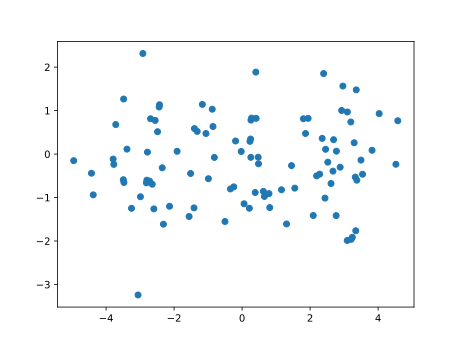
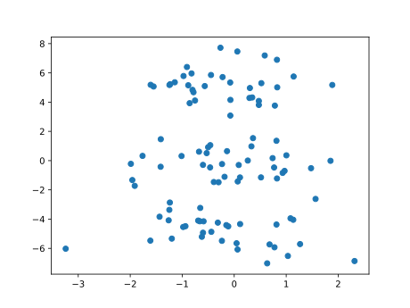
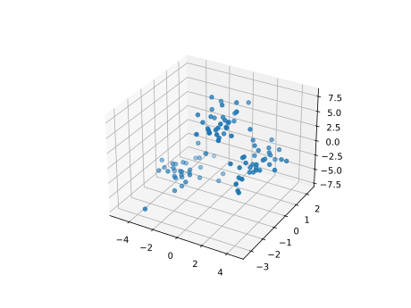
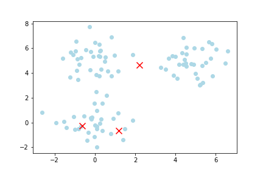
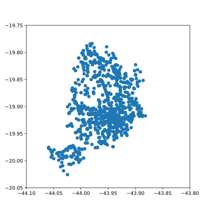
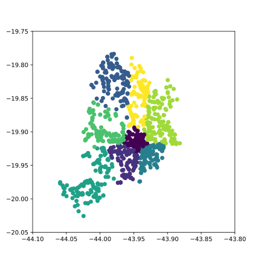
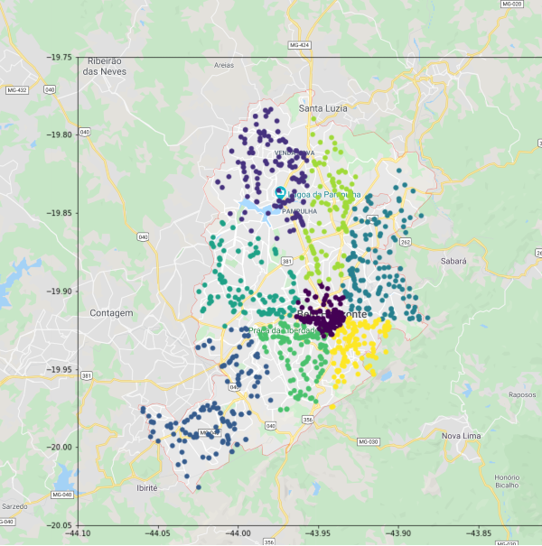

<!-- This is part 1 of my series on Unsupervised Learning. You can find the links to subsequent parts here when published. -->

Yann LeCun famously said that "_if intelligence is a cake, the bulk of the cake is unsupervised learning, the icing on the cake is supervised learning, and the cherry on the cake is reinforcement learning._"

If you are like me, you probably neglect unsupervised learning in favour of the sweeter icing, supervised learning. After all, it is a lot more exciting as the majority of research and news surrounding machine learning focuses on supervised learning. Even most textbooks only dedicate one measly chapter to unsupervised learning. How then, is it the cake, and supervised learning the icing?

Well, what is the one thing that often prevents data science projects from going ahead? Good clean labelled data. Unless you have those pesky labels, you can't supervise much, can you? Unsupervised learning can help with this, and many other tasks.

So let's cut ourselves a slice of unsupervised cake, and see how well it pairs with a cup of actuarial tea. (I will stop with the cake analogy now, I know someone is cringing.)

This post is part of a series on unsupervised learning and its possible applications in actuarial science. I will update each post with a link to the others as they are published.

## Clustering

Let's start with unsupervised learning's most widely known ability: **clustering**.

Clustering involves taking data and _clustering_ together similar observations. Consider the following table of data, for example.

```python
from sklearn.datasets import make_blobs
import pandas as pd

centers = [(3, 0, 0), (0, 0, 5), (-3, 0, -5)]
X, y = make_blobs(n_samples=100, centers=centers, shuffle=True, random_state=42)
df = pd.DataFrame(X, columns=["Column 1", "Column 2", "Column 3"])
```

<div>
<style scoped>
    .dataframe tbody tr th:only-of-type {
        vertical-align: middle;
    }

    .dataframe tbody tr th {
        vertical-align: top;
    }

    .dataframe thead th {
        text-align: right;
    }
</style>
<table border="1" class="dataframe">
  <thead>
    <tr style="text-align: right;">
      <th></th>
      <th>Column 1</th>
      <th>Column 2</th>
      <th>Column 3</th>
    </tr>
  </thead>
  <tbody>
    <tr>
      <th>0</th>
      <td>-2.783541</td>
      <td>0.045572</td>
      <td>-5.6516</td>
    </tr>
    <tr>
      <th>1</th>
      <td>-2.348609</td>
      <td>-0.315269</td>
      <td>-4.241031</td>
    </tr>
    <tr>
      <th>2</th>
      <td>-2.80094</td>
      <td>-0.600217</td>
      <td>-4.930198</td>
    </tr>
    <tr>
      <th>3</th>
      <td>-2.989767</td>
      <td>-0.981509</td>
      <td>-4.537897</td>
    </tr>
    <tr>
      <th>4</th>
      <td>2.520826</td>
      <td>-0.185659</td>
      <td>-1.106335</td>
    </tr>
    <tr>
      <th>...</th>
      <td>...</td>
      <td>...</td>
      <td>...</td>
    </tr>
    <tr>
      <th>95</th>
      <td>-1.514847</td>
      <td>-0.446515</td>
      <td>5.856399</td>
    </tr>
    <tr>
      <th>96</th>
      <td>2.35488</td>
      <td>0.361396</td>
      <td>1.538037</td>
    </tr>
    <tr>
      <th>97</th>
      <td>-3.772825</td>
      <td>-0.236819</td>
      <td>-5.485364</td>
    </tr>
    <tr>
      <th>98</th>
      <td>3.375698</td>
      <td>-0.600639</td>
      <td>-0.291694</td>
    </tr>
    <tr>
      <th>99</th>
      <td>0.404051</td>
      <td>1.886186</td>
      <td>5.174578</td>
    </tr>
  </tbody>
</table>
</div>

Nothing special to the human eye right? If we plot the first two dimensions, we can’t discern much.



But if we plot the last two dimensions, there seems to be a pattern.



Its almost as if the data forms three distinct blobs. It is a bit difficult to see in two dimensions, so let's try three.

```python
from mpl_toolkits import mplot3d

ax = plt.axes(projection="3d")
ax.scatter(X[:, 0], X[:, 1], X[:, 2])
```



Now we can clearly see three blobs of data! There is a pattern to that madness after all. Clearly some data points are **similar** to other data points, and, under the right conditions they will be **close** together. In this case, the right conditions for our human eyes to see the blobs were achieved by manipulating the data into a three dimensional plot.

Keep this idea of **manipulating our data to meet the right conditions** in mind as we progress through the series. It will be more and more important as we increase the complexity of our unsupervised methods.

This example was easy because we are only dealing with 3 dimension. But, as humans, we can only see in up to 3 dimensions. Even if you can see in four or five, you'll have a problem as soon as your data has six or seven dimensions. So it will be impossible for us to plot any and all data.

This is why we have clustering algorithms. They use mathematics to "see" how close the data are in many dimensions. They see what we cannot see, and they do it infinitely faster than we can.

## KMeans Clustering

**KMeans** clustering is normally everyone's first introduction to clustering because it is a really simple algorithm that almost mimics how humans perceive clusters. It pretty much just looks at which data points are closest to a random point, and moves that point until it is in the center of a cluster (essentially as close as it can be to all points in that cluster).

This is really best demonstrated visually. In the image below, you can see some scattered data and three centroids (indicated by an x) that move to the center of each cluster. **KMeans** starts by placing **k** centroids randomly in the data space. In this case, 3 centroids in 2 dimensions. **k** is the number of clusters you want to find.



Then, all the data points closest to a given centroid are allocated to that centroid. **KMeans** then calculates the **mean location** of all these data points closest to the given centroid as the _next_ centroid. This then causes the centroid to shift to the mean location of all the data points allocated to it. Hence the name, **KMeans**.

The process is then repeated. That is, all the data points closest to the latest centroid are allocated to the _latest_ centroid. Because the _latest_ centroid is in a different location to the _previous_ centroid, new data points might be allocated to it. Because new data points are allocated to it, the mean location of all these points is different, and the next centroid shifts to the mean location of the new data points. This process is repeated until the subsequent centroids no longer shift. At this point, you have found your **k** clusters.

Take a minute or two to appreciate the simplicity of the algorithm at work.

So, let's apply **KMeans** to the dummy dataset above and see what we get!

```python
data = pd.DataFrame(X)

from sklearn.cluster import KMeans

km = KMeans(n_clusters=3, random_state=42, n_init='auto')
km.fit(data)

km.labels_
```

```text
array([1, 1, 1, 1, 0, 1, 2, 1, 0, 1, 0, 1, 0, 2, 0, 2, 2, 0, 2, 0, 0, 2,
       0, 1, 2, 2, 2, 0, 0, 0, 2, 2, 0, 1, 2, 2, 0, 0, 2, 1, 0, 2, 1, 1,
       1, 1, 2, 0, 0, 2, 0, 1, 2, 0, 0, 0, 1, 2, 2, 2, 2, 2, 1, 1, 2, 1,
       0, 1, 1, 0, 2, 0, 1, 0, 1, 2, 1, 1, 0, 2, 1, 1, 0, 0, 1, 0, 2, 0,
       2, 2, 0, 1, 1, 1, 2, 2, 0, 1, 0, 2])
```

KMeans has found 3 clusters and allocated them the labels 0, 1, and 2. Now, lets look at that 3D plot again, but this time colouring the blobs based on the labels KMeans assigned to them.

```python
colour_map = {0: "r", 1: "g", 2: "b"}
colour_map = [colour_map[label] for label in y]
ax = plt.axes(projection="3d")
ax.scatter(X[:, 0], X[:, 1], X[:, 2], c=colour_map)
```


That is pretty damn good. But, the big question is, how does this help us in our day to day actuarial jobs? Let's look at some applications in **pricing**.

## Portfolio Segmentation

One of the most straightforward applications of clustering is in segmenting data for pricing. In pricing, we often need to split our data into homogeneous subgroups to improve our models' ability to fit to the data. An extremely basic example of this is splitting insurance portfolios by class of business. You should price motor policies and property policies separately, as they have very different risk characteristics.

Further, you would typically split your motor policies into personal motor, and commercial motor, and then split each of these into own property damage, bodily injury, and third-party liability. This way, you segment your data into groups that tend to behave similarly, and as a result, you would expect your models to fit better as there will be less variance in the data.

We could take this further. In fact, some insurers do. For example, if we were pricing own property damage, we could split it into 2 more groups. Perhaps, those with more than 5 years of insurance history, and those with less than 5 years, based on our belief that those with a longer insurance history might exhibit similar experience. But, this is typically done subjectively based on our beliefs (or maybe some basic data analysis).

Well, we can use clustering to do this for us. For example, we can use features such as power of the vehicle, number of kilometers driven, age of the driver, etc, to segment our data into similar clusters. These clusters would exhibit similar patterns and risk factors, and we may expect their experience to be similar too. We can then build separate pricing models for each of these clusters in the typical fashion.

## Generating Features

A more exciting application is in processing data and generating new features. In fact, a really exciting example is in geospatial analysis.

There are many ways to incorporate geospatial features into data analysis and pricing. But perhaps one of the simplest is by using clustering. Instead of talking through this application, let's load up a dataset and give it a try.

```python
import pandas as pd

data = pd.read_csv(
    "https://raw.githubusercontent.com/cbalona/modernactuary.co.za/master/data/brautocoll.csv",
    index_col=0,
)
data["Hour"] = pd.to_datetime(data["Hour"], format="%H:%M").dt.hour
```

<div>
<style scoped>
    .dataframe tbody tr th:only-of-type {
        vertical-align: middle;
    }

    .dataframe tbody tr th {
        vertical-align: top;
    }

    .dataframe thead th {
        text-align: right;
    }
</style>
<table border="1" class="dataframe">
  <thead>
    <tr style="text-align: right;">
      <th></th>
      <th>Date</th>
      <th>Day</th>
      <th>Hour</th>
      <th>Lat</th>
      <th>Long</th>
      <th>Type</th>
      <th>Severity</th>
    </tr>
  </thead>
  <tbody>
    <tr>
      <th>1</th>
      <td>2011-02-01</td>
      <td>Tuesday</td>
      <td>0</td>
      <td>-19.883859</td>
      <td>-43.935198</td>
      <td>Collision</td>
      <td>Nonfatal</td>
    </tr>
    <tr>
      <th>2</th>
      <td>2011-02-01</td>
      <td>Tuesday</td>
      <td>0</td>
      <td>-19.883859</td>
      <td>-43.935198</td>
      <td>Collision</td>
      <td>Nonfatal</td>
    </tr>
    <tr>
      <th>3</th>
      <td>2011-02-01</td>
      <td>Tuesday</td>
      <td>6</td>
      <td>-19.796731</td>
      <td>-43.995339</td>
      <td>Running over</td>
      <td>Nonfatal</td>
    </tr>
    <tr>
      <th>4</th>
      <td>2011-02-01</td>
      <td>Tuesday</td>
      <td>6</td>
      <td>-19.904608</td>
      <td>-43.945605</td>
      <td>Running over</td>
      <td>Nonfatal</td>
    </tr>
    <tr>
      <th>5</th>
      <td>2011-02-01</td>
      <td>Tuesday</td>
      <td>7</td>
      <td>-19.929828</td>
      <td>-43.930194</td>
      <td>Running over</td>
      <td>Nonfatal</td>
    </tr>
    <tr>
      <th>...</th>
      <td>...</td>
      <td>...</td>
      <td>...</td>
      <td>...</td>
      <td>...</td>
      <td>...</td>
      <td>...</td>
    </tr>
    <tr>
      <th>1310</th>
      <td>2011-02-09</td>
      <td>Wednesday</td>
      <td>17</td>
      <td>-19.930996</td>
      <td>-43.930575</td>
      <td>Collision</td>
      <td>Nonfatal</td>
    </tr>
    <tr>
      <th>1311</th>
      <td>2011-02-09</td>
      <td>Wednesday</td>
      <td>17</td>
      <td>-19.804461</td>
      <td>-43.97038</td>
      <td>Collision</td>
      <td>Nonfatal</td>
    </tr>
    <tr>
      <th>1312</th>
      <td>2011-02-09</td>
      <td>Wednesday</td>
      <td>19</td>
      <td>-19.945584</td>
      <td>-43.934321</td>
      <td>Running over</td>
      <td>Nonfatal</td>
    </tr>
    <tr>
      <th>1313</th>
      <td>2011-02-09</td>
      <td>Wednesday</td>
      <td>19</td>
      <td>-19.85601</td>
      <td>-43.912307</td>
      <td>Collision</td>
      <td>Nonfatal</td>
    </tr>
    <tr>
      <th>1314</th>
      <td>2011-02-09</td>
      <td>Wednesday</td>
      <td>22</td>
      <td>-19.920167</td>
      <td>-43.94083</td>
      <td>Collision</td>
      <td>Nonfatal</td>
    </tr>
  </tbody>
</table>
</div>

This dataset is from the _R_ package CASDatasets. It contains 1,314 motor claim events in the city of <a href="https://en.wikipedia.org/wiki/Belo_Horizonte">Belo Horizonte</a> (which means Beautiful Horizon) in Brazil. It is the sixth largest city of Brazil. The data shows the date of the event, the weekday, hour, location via latitude and longitude, type of collision, and the severity.

What is interesting to us is the latitude and longitude. If we were using this data to price an insurance product, we could use the location data in our pricing model as a rating factor telling us which locations are higher or lower risk.

Now, we could just use the latitude and longitude directly as features in the pricing model, but there are some intricacies to that. For one, there is actually a relationship between latitude and longitude, they work together, so we need to be able to capture that relationship reliably, and we can't do that by just including them as standalone features in our model. Don't get me wrong, we definitely can use them, but that is a topic for another blog post in future. Today, I want to demonstrate how we can use clustering as a very simple means to incorporating geospatial features into our models.

Let's plot the latitude and longitude columns:

```python
import matplotlib.pyplot as plt

plt.figure(figsize=(6, 6))
# When plotting coordinate data, its necessary to have the correct
# scaling on each of the axes, or else it will appear stretched
plt.xlim(-44.1, -43.8)
plt.ylim(-20.05, -19.75)

plt.scatter(data["Long"], data["Lat"])
```



Looking at that plot, we can already say we have at least two clusters. One big blob in the top right, and a smaller blob in the bottom left. But, we have an algorithm to do this for us, and it can do it better. Lets run the simple KMeans algorithm on the data and see what we get. We will choose 8 clusters based on nothing but the fact that it was the first number that popped into my head.

```python
from sklearn.preprocessing import OrdinalEncoder
from sklearn.cluster import KMeans

# First encode the day of the week information to integers
encoder = OrdinalEncoder()
data_encoded = encoder.fit_transform(data[["Day", "Hour", "Lat", "Long"]])

km = KMeans(n_clusters=8, random_state=42, n_init='auto')
km.fit(data_encoded)

km.labels_
```

```
array([7, 7, 2, ..., 3, 6, 0])
```

We can see that it has found labels for all of the data; but it is boring to look at an array of numbers. Let's plot it and see what it looks like.

```python
plt.figure(figsize=(6, 6))
plt.xlim(-44.1, -43.8)
plt.ylim(-20.05, -19.75)
plt.scatter(
    data["Long"], data["Lat"], c=km.labels_
)  # colour the points based on the labels KMeans found
```



Well look at that. KMeans has clearly segmented the location data into regions. But what does it actually mean? Let's place it over a map of the actual city and see what it has found:



I still find it so cool that plotting coordinate data resembles the physical location. I mean, its not surprising that it does, its literally the location of places in the real world, but it is just amazing to see how a table of data can be formed into something physically real from across the world on my computer.

What stands out most to me is the central purple cluster, which basically relates to the city center of Belo Horizonte. Clearly, this is where you'd expect to see the highest frequency of claim events, and KMeans has segmented it as its own unique area.

We can also see how in some parts it has segmented the city into areas which appear to be bordered by major roads or highways. This makes sense to me, in that major highways almost act as borders between metropolitan areas. You generally don't need to cross a major highway to get to a nearby store, as there is normally a sufficient supply in your local neighbourhood. And, you normally only go to the highway to get on it and drive to your place of work, which is likely to be in the city center.

## Great, we clustered coordinates that are close together, so what?

Well, from here you could use the clusters that KMeans has found and input them as features in your pricing model. This way, the model will be able to incorporate some basic geospatial information into its prediction.

You will probably find that the highest risk area is the city center. So, those that park their cars there during the day are likely traveling around the area during the day (to or from work, to get lunch, etc). Then, you could also consider where the car is parked at night, perhaps in a less risky area in the outskirts of the city.

To include these two features in your model, you would take the location of all of the policyholders’ homes and workplaces, map them to coordinates, and use a KMeans model to determine the clusters. The cluster labels are then included as features in the model.


When a new policyholder comes for a quote, you take their home and workplace, map this to a coordinate, and use your KMeans model to predict what cluster they belong to, and determine a price.

## Closing Remarks

What I hope for this series of posts to do is generate some thought around using unsupervised learning in the actuarial space. I have demonstrated two basic applications of clustering, but there are more forms of unsupervised learning with more applications.

In the coming weeks, I hope to post one or two more applications of unsupervised learning in the actuarial space. As always, please reach out with any thoughts, ideas, applications, suggestions, etc.