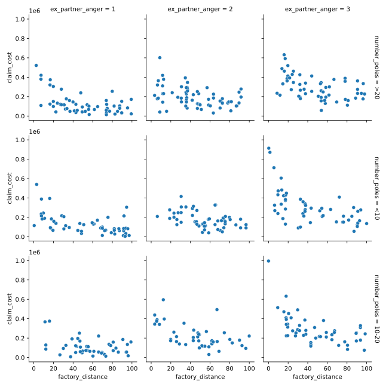
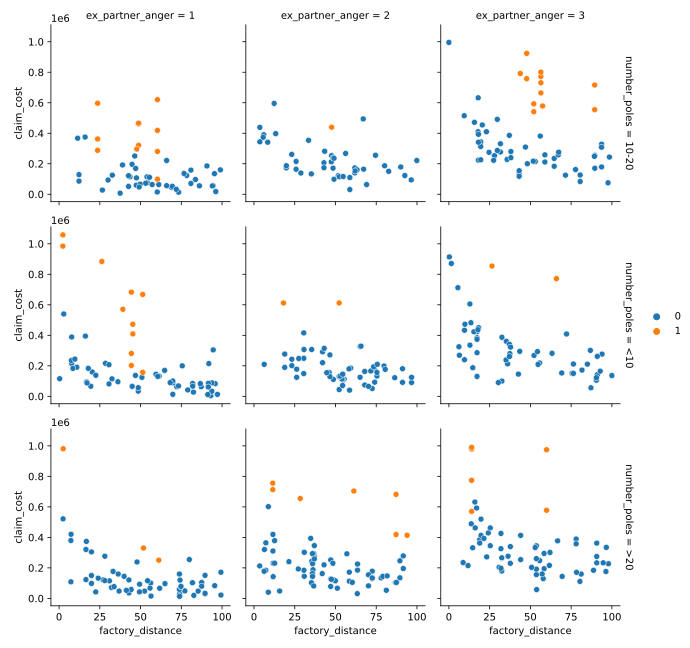
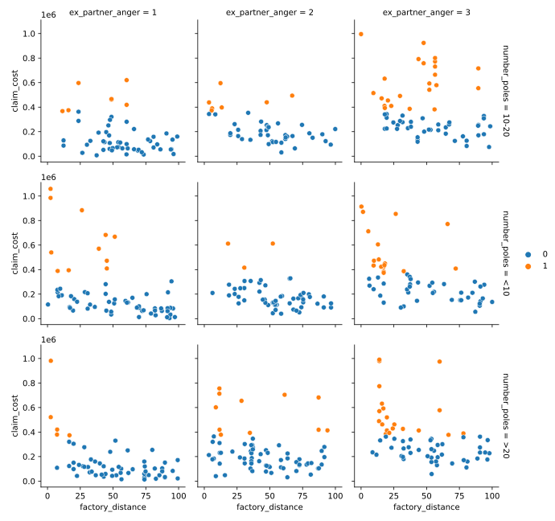
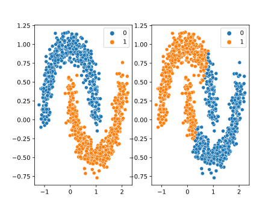
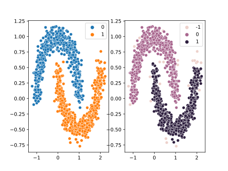
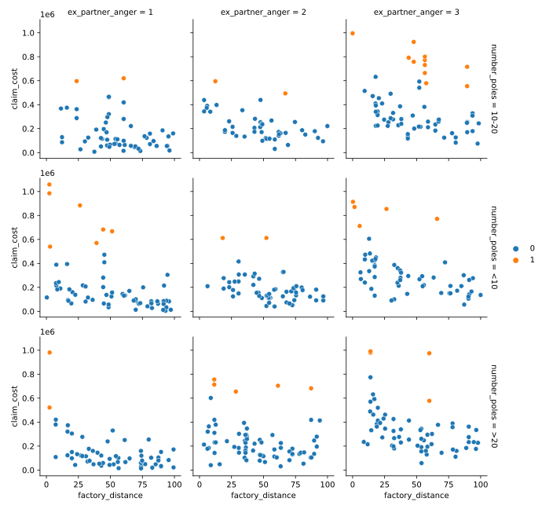
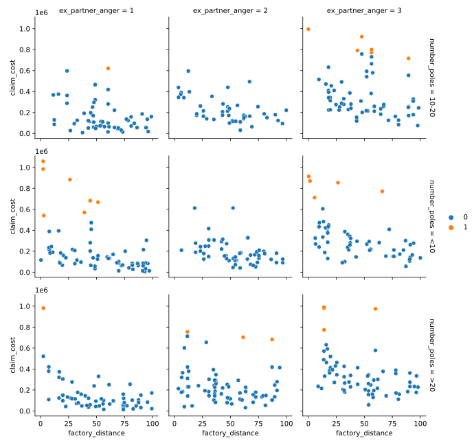

_This post is part of a series on unsupervised learning and its possible applications in actuarial science. For Part 1, click [here](http://modernactuary.co.za/journal/cutting-a-slice-of-unsupervised-cake-part-1)._

In the previous post, we discussed how we can use **clustering**, a type of unsupervised learning, to segment data into homogeneous groups, or create new features by analysing geospatial data. In this post, we will use unsupervised learning techniques to detect outliers.

Now, detecting or finding outilers can be quite a subjective endeavour. It's not an exact science. For example, if I generate random numbers from a standard normal distribution, I can certainly get a value of 4, which is an extremely unlikely outcome. Some would say, this is definitely an outlier. In fact, the probability of getting a value larger than 4 is 0.003%. But what about 3? The probability is 0.135%. Hmm, I guess some would say it is still an outlier. Let's try 2, the probability is now 2.275%. Is this an outlier? Tough to say. Further, what makes an outlier an outlier, is its comparison to the sample it is from. Let’s look at a definition for what an outlier is:

> An outlying observation, or "outlier," is one that appears to deviate markedly from other members of the sample in which it occurs.
> Grubbs, F. E. (February 1969). "Procedures for detecting outlying observations in samples". Technometrics. 11 (1): 1-21

What does "deviate markedly" even mean? Is a difference of 2 "markedly" different? Or is 3 "markedly" different?

My point is, there is a lot more to detecting outliers than meets the eye. Wouldn't it be great if we could just take the guess work out of it and use some algorithm (that we trust and that suits our use case) to do the thinking for us? Yes we can. And that is what we will do in this post.

To help us along I will leverage the random insurer code I wrote about in this [post](http://modernactuary.co.za/journal/starting-a-random-insurer). I will inject outliers into the simulated data and see if the unsupervised methods can detect them. Yes, there is no "correct" answer here, so measuring the performance is not exactly useful. But, it helps to ground things and give us a bit of a reference point when trying these methods. So let's start by generating some claims.

```python
import numpy as np
import pandas as pd
from scipy.stats import beta, poisson

N_POLICIES = 1000
POISSON_MEAN = 0.5
BETA_A = 4
BETA_B = 15
SUM_INSURED = 1e6
PREMIUM = 0.1 * SUM_INSURED

ExAngerModifier = {
    1: 0.5,
    2: 1,
    3: 1.5
}

NumPolesModifier = {
    '<10': 0.75,
    '10-20': 1,
    '>20': 1.25
}

def DistanceModifier(distance):
    return 6 / np.sqrt(distance)

class Policy():
    def __init__(self, ID, sum_insured, premium, ex_partner_anger, number_poles, factory_distance):
        self.ID = ID
        self.sum_insured = sum_insured
        self.premium = premium
        self.ex_partner_anger = ex_partner_anger
        self.number_poles = number_poles
        self.factory_distance = factory_distance

    def simulate_claims(self):

        beta_a = BETA_A * ExAngerModifier[self.ex_partner_anger]
        beta_b = BETA_B / DistanceModifier(self.factory_distance) # Smaller BETA_B = larger variance

        poisson_mu = POISSON_MEAN * NumPolesModifier[self.number_poles] * DistanceModifier(self.factory_distance)

        self.n_claims = poisson.rvs(mu=POISSON_MEAN)
        self.claims = {
            claim_id:beta.rvs(a=beta_a, b=beta_b, size=1)[0] * self.sum_insured for claim_id, n in enumerate(range(self.n_claims))
        }

def simulate_company(n_policies):

    anger_levels = np.random.choice([1, 2, 3], size=1000)
    number_poles = np.random.choice(['<10', '10-20', '>20'], size=1000)
    factory_distance = np.random.rand(1000) * 100 # Random distance between 0 and 100

    policy_db = {
        policy_id:Policy(
            policy_id,
            SUM_INSURED,
            PREMIUM,
            ex_partner_anger=anger_levels[policy_id],
            number_poles=number_poles[policy_id],
            factory_distance=factory_distance[policy_id],
        ) for policy_id in range(N_POLICIES)
    } # Sell 1000 policies

    for policy_id, policy in policy_db.items():
        policy.simulate_claims()

    return policy_db

def migrate_policy_db(policy_db):

    ids = []
    sums_insured = []
    premiums = []
    ex_partner_anger = []
    number_poles = []
    factory_distance = []
    n_claims = []

    for policy_id, policy in policy_db.items():
        ids.append(policy.ID)
        sums_insured.append(policy.sum_insured)
        premiums.append(policy.premium)
        ex_partner_anger.append(policy.ex_partner_anger)
        number_poles.append(policy.number_poles)
        factory_distance.append(policy.factory_distance)
        n_claims.append(policy.n_claims)

    df = pd.DataFrame({
        'policy_id': ids,
        'sum_insured': sums_insured,
        'premium': premiums,
        'n_claims': n_claims,
        'ex_partner_anger': ex_partner_anger,
        'number_poles': number_poles,
        'factory_distance': factory_distance,
    })

    return df

def migrate_claims_db(policy_db):

    # Define the columns of the table
    policy_ids = []
    claim_ids = []
    claim_costs = []

    # Fetch the values for the columns
    for policy_id, policy in policy_db.items():
        for claim_id, claim_cost in policy.claims.items():
            policy_ids.append(policy_id)
            claim_ids.append(claim_id)
            claim_costs.append(claim_cost)

    # Slap it all into a dataframe
    df = pd.DataFrame({'policy_id': policy_ids, 'claim_id': claim_ids, 'claim_cost': claim_costs})

    return df

policy_db = simulate_company(N_POLICIES)
policy_df = migrate_policy_db(policy_db)
claim_df = migrate_claims_db(policy_db)
inlier_data = policy_df.merge(claim_df, on='policy_id')
```

Okay, so there is our "inlier" data. Data generated directly from our distribution assumptions. And yes, there are probably outliers in the inliers. That is, extreme observations that are quite rare, and through a manual assessment we would consider to be outliers. Look at this plot of the data:



Specifically on the top left of each axes we see some extreme observations. And, throughout the axes there does seem to be one or two points quite a bit higher than the rest. We might call these outliers already. But, let’s hold off for a bit and wait for our unsupervised methods to tell us rather.

We can also see some patterns, clusters of results even. For example, with ex_partner_anger at 3, and the number_poles between 10-20, the claims tend to be a bit higher, similarly for poles <10. Overall, we can see there is a general pattern to our data, and this pattern extends into the 4 dimensional space of the 4 variables we have plotted.

So now, let's inject some outliers. Let’s take our usual claim simulation process, and let's tweak the distributional parameters to be a bit out of line with what was initially used. This will help us to get some idea of performance and see if our methods find points that literally come from a different distribution altogether.

```python
N_POLICIES = 50
POISSON_MEAN = 0.5 * 2
BETA_A = 4 * 2
BETA_B = 15 / 2  # Smaller BETA_B = larger variance
SUM_INSURED = 1.2e6

outlier_policy_db = simulate_company(N_POLICIES)
outlier_policy_df = migrate_policy_db(outlier_policy_db)
outlier_claim_df = migrate_claims_db(outlier_policy_db)
outlier_data = outlier_policy_df.merge(outlier_claim_df, on='policy_id')

inlier_data['outlier'] = 0
outlier_data['outlier'] = 1
data = pd.concat([inlier_data, outlier_data]).sample(frac=1)
```



We can clearly see our outliers to tend to be quite a bit different to the other points. But, in some cases, they are also quite similar. If we didn’t highlight them, we might never know which are the actual outliers.

So, let's use unsupervised methods to extract outliers from the data, and see if they capture some of the injected outliers too.

## KMeans

Let's try good old **KMeans** from my previous post and see how it does. I will choose 2 as the number of components, 1 for cluster for inliers, 1 cluster for outliers.

```python
from sklearn.cluster import KMeans

pole_map = {'<10': 5, '10-20': 15, '>20': 25} # Convert categorical to ordinal

train, labels = data[['ex_partner_anger', 'number_poles', 'factory_distance', 'claim_cost']].copy(), data[['outlier']].copy()
train['number_poles'] = train['number_poles'].map(pole_map)

km = KMeans(n_clusters=2)
km.fit(train)

data['KMeans'] = km.labels_

g = sns.FacetGrid(data, col='ex_partner_anger', row='number_poles', margin_titles=True)
g = (g.map(sns.scatterplot, 'factory_distance', 'claim_cost', 'KMeans', edgecolor='w').add_legend())
```



Not bad. At first glance, KMeans appears to have selected some really decent outliers. Pretty close to what we may manually select as outliers too. Let's see how we actually performed with some metrics. Note that with real-world unsupervised learning we won’t have the benefit of these metrics at all, because we won't have labels! And, our definition of what an outlier is will be subjective and depend on the data. So, it is just for demonstration and discussion.

```python
from sklearn.metrics import accuracy_score

print("Accuracy:", f"{accuracy_score(data['outlier'], km.labels_):.2%}")
```

```output
Accuracy: 86.60%
```

The accuracy looks great. But, accuracy is a poor metric in this example. If we just guess 0 we can get a really good score (around 500/550 = ~90%) because our dataset is highly imbalanced. Class imbalance is a real pain that occurs in most real world machine learning problems. I hope to tackle it a bit in a future post.

We should rather look at precision and recall as better metrics, as well as the F1 score (which is a combination of precision and recall), to get a better idea of our performance. To learn a bit more about these metrics, have a peek over [here](https://developers.google.com/machine-learning/crash-course/classification/precision-and-recall).

```python
from sklearn.metrics import precision_score, recall_score, f1_score

print("Precision:", f"{precision_score(data['outlier'], km.labels_):.2%}")
print("Recall:", f"{recall_score(data['outlier'], km.labels_):.2%}")
print("F1:", f"{f1_score(data['outlier'], km.labels_):.2%}")
```

```output
Precision: 42.31%
Recall: 80.00%
F1: 55.35%
```

We are pretty bad at finding the outliers then. Of those we detect as outliers, only ~42% actually are outliers. And, we are only capturing about 80% of the outliers. That’s not absolutely terrible, but its pretty bad.

KMeans is a great algorithm, but it is not necessarily suited to this task. Sure we may say that our inliers are clustered together because they come from the same distribution, but our outliers aren’t necessarily clustered together, are they? And, just think of how KMeans works (remind yourself here if you need), it's trying to split data points by their distance from each other. But, what if our two data points can be from two separate "true" clusters, but still be really close together? What am I rambling on about? Have I finally lost it?

Consider the plot below, you may have seen a variation of it in a textbook or on some data science post. Note that there are clearly two separate distributions of data. The top blue set, and the bottom orange set. But, also note that the data points of the two disparate sets of data get really close at certain points, particularly within the curve. If we use KMeans on this dataset (right hand image), we see that it cannot differentiate between the two datasets because it works purely on distance. So, we might be seeing the same issue in our data.

```python
from sklearn.datasets import make_moons
import matplotlib.pyplot as plt

noisy_moons = make_moons(n_samples=1000, noise=.1)

km = KMeans(n_clusters=2)
km.fit(noisy_moons[0])

fig, axs = plt.subplots(1, 2)
sns.scatterplot(x=noisy_moons[0][:, 0], y=noisy_moons[0][:, 1], hue=noisy_moons[1], ax=axs[0])
sns.scatterplot(x=noisy_moons[0][:, 0], y=noisy_moons[0][:, 1], hue=km.labels_, ax=axs[1])
```



Another problem with KMeans is that we have zero control over what our outlier cluster is. In fact, we could easily end up with just two clusters of data with 50% of our data in each. What do we then? We can’t say half our data are outliers. KMeans is not geared toward finding anomalies.

Let's try another algorithm then. A widely used and extremely versatile clustering algorithm is DBSCAN, and it has one really useful feature.

## DBSCAN

```python
from sklearn.cluster import DBSCAN

db = DBSCAN(eps=0.1, min_samples=5)
db.fit(noisy_moons[0])

fig, axs = plt.subplots(1, 2)
sns.scatterplot(x=noisy_moons[0][:, 0], y=noisy_moons[0][:, 1], hue=noisy_moons[1], ax=axs[0])
sns.scatterplot(x=noisy_moons[0][:, 0], y=noisy_moons[0][:, 1], hue=db.labels_, ax=axs[1])
```



See how well DBSCAN differentiates the two clusters? Much better. Although it does take some tweaking of the parameters (that I won't get into in this post) to get the right results. Look at the labels it assigned. One of the clusters has the label "-1". DBSCAN does not try to find a cluster for every point. If any data point does not align itself (according to our parameters) to a cluster, DBSCAN just gives it a label of -1, because it can’t find similar data points. Well hey, DBSCAN is finding outliers! And that is exactly what we need. Let's run DBSCAN on our data and see what it comes up with.

```python
from sklearn.preprocessing import StandardScaler

scaler = StandardScaler()
train_sc = scaler.fit_transform(train)

db = DBSCAN(eps=1, min_samples=10)
db.fit(train_sc)

data['DBSCAN'] = 0
data.loc[db.labels_ < 0, 'DBSCAN'] = 1

g = sns.FacetGrid(data, col='ex_partner_anger', row='number_poles', margin_titles=True)
g = (g.map(sns.scatterplot, 'factory_distance', 'claim_cost', 'DBSCAN', edgecolor='w').add_legend())
```



DBSCAN has found slightly less outliers, but these outliers are a lot more convincing than what KMeans found. Having a look at our metrics, we see exactly that:

```python
print("Precision:", f"{precision_score(data['outlier'], data['DBSCAN']):.2%}")
print("Recall:", f"{recall_score(data['outlier'], data['DBSCAN']):.2%}")
print("F1:", f"{f1_score(data['outlier'], data['DBSCAN']):.2%}")
```

```output
Precision: 80.00%
Recall: 58.18%
F1: 67.37%
```

It has found less outliers (recall is lower) but the outliers are more convincing (precision is higher). And overall, does a bit of a better job than KMeans (F1 score higher).

DBSCAN basically looks at the density of the data and considers densely packed areas as part of a single cluster. For each datapoint, it considers a neighbourhood of some radius, where the width is defined as epsilon (or eps in our code above). If there are a minimum number of other data points (min_samples) within this neighbourhood, then the data points are considered to be a part of the same cluster. It checks each data point individually. This method also allows it to determine its own number of clusters based on the different density regions. Finally, if any data point does not find itself in the neighbourhood of another point according to the conditions above, it is an anomaly, and is given the label -1. Those are our outliers.

For a graphical representation of the algorithm at work, have a look here: [DBSCAN GIF](http://primo.ai/index.php?title=Density-Based_Spatial_Clustering_of_Applications_with_Noise_%28DBSCAN%29)

Now, we don’t really have much control over how we identify the outliers, do we? For KMeans we have zero control. For DBSCAN we have some indirect control in our parameters. But what if we want direct control?

## Gaussian Mixture Models

Gaussian Mixture Models (GMMs) basically try to find normally distributed clusters in the data. If we say there are two clusters, it will try to find two normally distributed clusters. I really like what the scikit-learn documentation says about GMMs:

> One can think of mixture models as generalizing k-means clustering to incorporate information about the covariance structure of the data as well as the centers of the latent Gaussians.
>
> - [https://scikit-learn.org/stable/modules/mixture.html](https://scikit-learn.org/stable/modules/mixture.html)

So, we tell it we want 2 clusters, and the GMM will not only find two clusters, but it will fit a normal distribution to the cluster. What does this mean for us? It means we can control what we consider an outlier.

```python
from sklearn.mixture import GaussianMixture

gm = GaussianMixture(n_components=1)
gm.fit(train_sc)
```

```output
GaussianMixture()
```

Now, the above code fits the GMM and determines the clusters as well as their means and covariance matrices (for the N-dimensional normal distribution). Now, if we want to select some outliers, we simple need to find the probability that each data point comes from each cluster (in this case, 1 cluster), and exclude all those that have a probability below a certain threshold, such as 5%.

```python
densities = gm.score_samples(train_sc)
density_threshold = np.percentile(densities, 5)
data['GMM'] = 0
data.loc[densities < density_threshold, 'GMM'] = 1

g = sns.FacetGrid(data, col='ex_partner_anger', row='number_poles', margin_titles=True)
g = (g.map(sns.scatterplot, 'factory_distance', 'claim_cost', 'GMM', edgecolor='w').add_legend())
```



Now, we can play around with the threshold to detect more or less outliers. Much more control! There is even a Bayesian GMM that will automatically detect the optimal number of clusters for us. But, I will leave that as an exercise to the reader.

In terms of performance, we are a little worse than both the other methods. But remember, we can't really measure performance here, it is just an indicator or guide for us to see whats happening.

```python
print("Precision:", f"{precision_score(data['outlier'], data['GMM']):.2%}")
print("Recall:", f"{recall_score(data['outlier'], data['GMM']):.2%}")
print("F1:", f"{f1_score(data['outlier'], data['GMM']):.2%}")
```

```output
Precision: 81.48%
Recall: 40.00%
F1: 53.66%
```

## Closing Remarks

Next time you begin a project and you come to the point where you need to exclude some outliers (or determine if you do), bring your mind back to this post and give each of these methods a shot. There are also numerous other methods to explore including (but certainly not limited to) Isolation Forests (tree-based), or Fast-MCD (which is close to the approach of the GMM, but more geared toward outlier detection). Look up these methods and give them a try.

Remember to question your results and challenge them. If you run Isolation Forest on our data set above, you get terrible results. So don't think these methods are silver bullets that solve all your problems.

I hope this post can spark some thought or discussion amongst the actuarial community, and introduce some new ideas to explore or experiment with. Please get in touch if you'd like to discuss or have ideas or topics you'd like explored.
