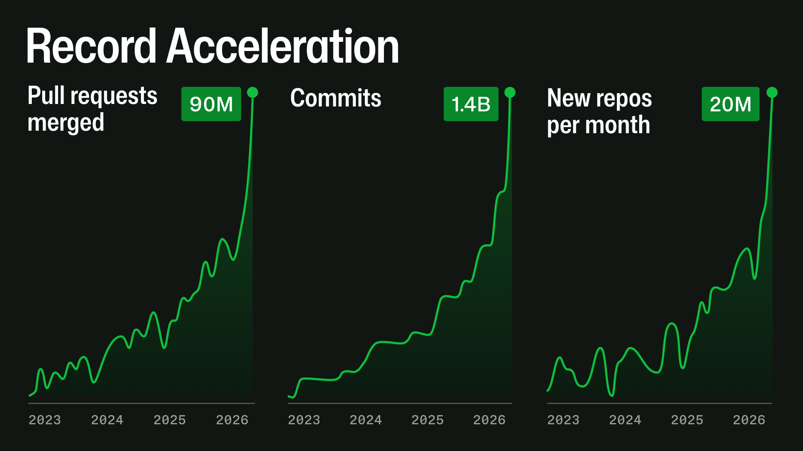

In its April update, GitHub detailed huge spikes in activity that led to some downtime. [See the update](https://github.blog/news-insights/company-news/an-update-on-github-availability/).

That is a huge increase. But activity is not the same as value. Does more output mean more value, or are we simply consuming because we can?

## The ease and speed of consumption

Obesity has increased over time. According to the [World Health Organization](https://www.who.int/news-room/fact-sheets/detail/obesity-and-overweight), worldwide adult obesity more than doubled between 1990 and 2022, while adolescent obesity quadrupled. There are many arguments as to why. Some popular ones include:

- Portions have become larger. Perhaps you have seen the comparisons between McDonald's in the UK and the US, for example.
- Food has become more calorie-dense for flavour, through high fat and high sugar content.
- We move less because life is so much easier. We can work from home, where the “office” is likely a few steps from the bed. We can order in, and everything is delivered. We rarely have to move much.

Rather, I think the most important factor is the ease and speed of consumption.

We might think, for example, that companies try to make food as flavoursome and satisfying as possible so that we want more. That is partly true, but I think what matters even more to “Big Food” is volume. The more we eat, the more they sell; the more we demand, the more they grow.

To satiate shareholders, companies need to grow their top and bottom lines, while keeping a slim waist. If market share stays fixed, the market can grow only through population growth. But shareholders are hungry. That's not enough. We need to shoot for the moon and grow year on year. That means selling more to each person.

People can only eat so much, no matter how tasty the food is. So, let's make it easier and lighter to consume. If it takes half the effort to eat and digest, and is half the size, we can sell more and beat that pesky population problem.

The same principle applies to social media. Content is shorter and more impactful, so we consume hundreds of Reels in a sitting. Remove enough effort from consumption, and the available volume increases. That pattern is now spreading to other areas that typically took time, effort, and creativity.

## Consuming knowledge work

LLMs are applying that idea to programming and knowledge work. Chatbots let us engage with and think through things, but we still had to be the interface between them and our work. Now we have tools like coding harnesses that interact directly with our code. The friction between an idea and a finished project has fallen.

Sure, there are guardrails, but I'd bet many people hit that “dangerously accept permissions” button to make the process even easier, walk away, swipe some Reels, and come back to a working project.

The result is that we consume our knowledge work. We can swipe through our projects. Got an idea? Vibe it up. Great, feels great. Dopamine. Wait, what if we do this? Swipe. Yes, amazing. Dopamine. But wait, it would be great if I didn't have to specify that. I'm sure AI can automate it. Swipe. Perfect. Dopamine. Need a report? AI can generate it. Swipe. Dopamine. It looks good, but it's so long. Let's ask AI to review it. Swipe. AI says it's all good. Dopamine.

What's left? Where do we produce? Create? Express?

We consume food and media made by others, and now our work is made by others too. Sure, we are creating with AI. There is satisfaction in having an idea and making it tactile. It was our idea; we just skipped the hard part. And it was work! It's not like we did nothing. We guided the process. But much like buying flat-pack furniture, can we say we made it if we just assembled the parts?

## Processed content in practice

I've unfollowed many people on one of the two social media platforms I still use: LinkedIn. (The other is YouTube, but my history, recommendations, and Shorts are turned off. Infuriating to some, peace to me.) I followed them because I appreciated their views.

Over time, they shared more and more, and I began to see a pattern. Every few days, there would be a long post about a great idea or observation that had stuck with them. That is worth sitting with. It quietly changes how they think, which then changes what they do. It's not just an observation. It fundamentally changes how they think.

They once created content I consumed. It was quality, organic, whole content. Now, I am consuming highly processed versions of what they have consumed. Basically, they're baby-birding it to me. That doesn't sound appetising at all. Unfollow.

## Competing demands

The question is how we use the capacity created by efficiency. We can use it to produce more, improve what already matters, or reclaim time for something else. These uses compete for the same finite capacity, but they are not equally rewarded. Growth rewards more units. Quality is harder to measure, and reclaimed time often appears as underused capacity.

Perhaps the closest established idea is the [Jevons paradox](https://en.wikipedia.org/wiki/Jevons_paradox). Jevons argued that when something becomes more efficient, the cost of using it can fall enough to increase demand. Total consumption can then rise rather than fall. Efficiency does not automatically reduce consumption; it can make more consumption possible. If we consider *work* the resource, this could apply.

What is neater, though, is to think of what I am describing as an analogue of [Parkinson's law](https://en.wikipedia.org/wiki/Parkinson%27s_law). Parkinson's law says that work expands to fill the time available for its completion. In this version, efficiency expands the available capacity within a fixed amount of time, and work expands to fill it.

This is a means-and-ends problem. Work is a means to an end: solving a problem, explaining something clearly, building something useful, or caring for someone. A task is not valuable because it takes five days, and it is not worthless because it takes one. Its value depends on whether it achieves a worthwhile purpose, reliably, with costs proportionate to its importance.

Better work should not be valued simply because it takes longer. It should be valued when it is more accurate, durable, useful, understandable, or trustworthy. A quicker, worse version can be the right choice for a low-stakes task. For important work, speed can simply move the cost downstream into errors, rework, maintenance, confusion, or harm. When the number of outputs becomes the target, the measure displaces the purpose. This is a version of [Goodhart's law](https://en.wikipedia.org/wiki/Goodhart%27s_law).

The point is not that companies will naturally choose less work. They generally will not. Under growth pressure, released capacity becomes another input to be consumed. We can compare the time and output required before an efficiency gain with what happens afterwards. Did the time fall? Did the output increase? Did quality improve? Did new demands appear and absorb the saving? Or did we reclaim any of the capacity at all?

I like to use a simple example to show what I mean.

Let's say we have five tasks, **A**, **B**, **C**, **D**, and, you guessed it, **E**. Some are more important than others, so let's assume they are in order of importance and need.

Let's imagine a typical week. We have five days, and before AI, each task might take most of that week. We could do **A** this week, **B** the next, then **C**, and so forth. Maybe we only have time for those three, so **D** and **E** get dropped.

Introduce AI. If all the required things are in place to maximise its usage, and it makes us five times as productive, a task that took a week now takes a day. We can do a lower-quality version in half a day, which is **A-**, a normal version in one day, which is **A**, or a better version in two days, which is **A+**. What do we do with the remaining capacity?

This is where shareholder logic returns. We must grow. The week is still expected to be full, and the purpose has quietly changed from doing the important work well to filling the available capacity. So, **A**, **B**, **C**, **D**, and **E** get shoved into one week. Remember, we didn't really need **D** and **E**. But no harm, no foul. We got the work done. More work gets counted as progress.

Sometimes, **F**, **G**, **H**, **I**, and **J** get shoved in too. We now do **A-**, **B-**, **C-**, and so forth. That fills the five-day week and doubles output. Wait, where did **F** to **J** even come from? Well, someone said AI is the next big thing, and companies that don't use it will be left in the dust. So let's use it. Plus, our shareholders are mighty starving. Let's give them some processed food. More work done. We fed the shareholders.

This is the quantity pressure. Under growth pressure, a company can rationally convert the gain into more units. When the easy capacity is used up, it makes each unit faster, shallower, or less carefully checked so more units fit into the same week. That is the work equivalent of making food easier and lighter to consume so that more of it can be sold. We make the work worse to beat that pesky population problem.

The A+ option is not what shareholder logic gives us automatically. It is a deliberate decision to keep the week full, but spend the capacity on the purpose of the work rather than the count of outputs. AI can supplement our knowledge with a really slick system, allowing us to do better work in the same time.

So maybe, instead of **A**, **B**, **C**, **D**, and **E**, we do **A+**, **B+**, and **C**. **A+** and **B+** take two days each, while **C** takes one day. That uses the same five-day week, but we have spent it improving the work that matters most. Less work, but better work. Hell, we can do **A++**, **B**, and **C**, or any combination. More work is not automatically valuable, and neither is better work. Quality and quantity are competing demands for the same capacity, and quality is justified when it better serves the purpose of the work. Did we really need the others?

## Quality over quantity

We must be mindful of how we consume. We don't have to stop using AI. Consumption is part of life, and AI can be useful. But we can ask what the extra output is for, what it costs, and whether it serves the purpose of the work.

Quality over quantity. Less is more. Old adages, perhaps, but useful ones. Not because slower work is always better, but because activity is not the same as value.

So, when I see GitHub exploding in commits and repos, and companies generating so many products and projects, I ask: did we really need them? Or did we consume because we could? Did the extra output create value, or did we make the work worse so that more of it would fit?

I've made my choice.
