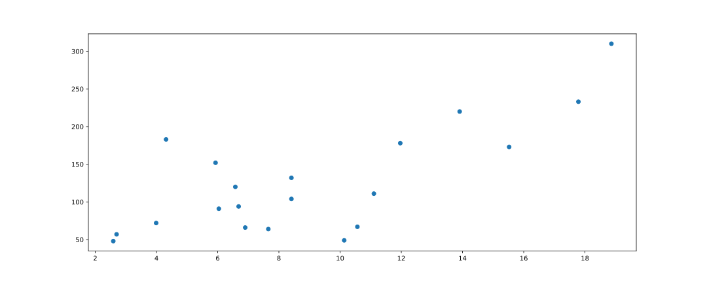
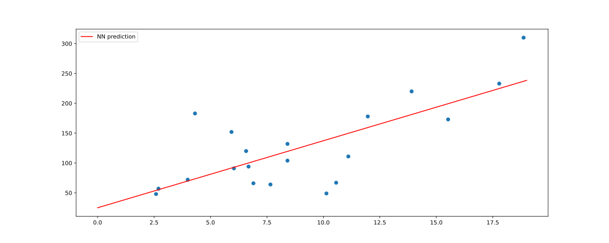
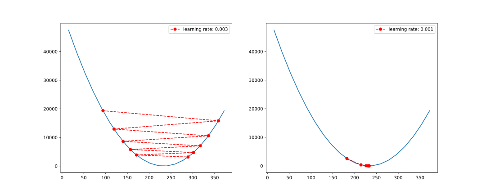

Deep learning and neural networks have been the driving force behind the recent hype in AI. Recent advances in computing power and data availability have allowed neural networks to perform amazing tasks such as producing human-like text ([GPT-3](https://openai.com/blog/gpt-3-apps/)) or create images from basic descriptions ([DALL-E](https://openai.com/blog/dall-e/)).

These deep neural networks are amazingly complex, and extremely massive, having billions of parameters, and taking weeks to train, using cutting edge architectures. This makes it very difficult for beginners to start delving into deep learning and neural networks. Further, deep learning software libraries like TensorFlow and PyTorch are large, cumbersome beasts, that are so highly engineered and optimised, that it is basically impossible for a beginner to dig into them and see how they tick.

So, I thought it would be useful to provide a very light and simple intro to the most basic starting point of all neural networks: the **perceptron**.

In this post, I will code a simple perceptron from scratch to demonstrate the basic inner workings of almost all neural networks. After reading this, you should hopefully have a some idea of what these mysterious neural networks are doing, and ideally have developed a taste for more.

## Our old friend: Linear Regression

Before we delve into neural networks, let's start with linear regression. I always like to relate new topics to older familiar topics. This helps to ease the learning curve, and once we have some intuition for how things work, we can focus on the details without being too confused.

Let's start by reading in a bit of data.

```python
import numpy as np
import matplotlib.pyplot as plt
from sklearn import datasets

# Load the diabetes dataset
x, y = datasets.load_diabetes(return_X_y=True)

# Use only one feature
x = x[:, np.newaxis, 2]

# Reduce size
x = x[-20:] * 100 + 10
y = y[-20:].reshape(-1, 1)

plt.scatter(x, y)
```



Great. Now, recall the formula for linear regression, something like this:


And, without going into the mathematical details (consult any introductory stats textbook for this), we can find **m** and **b** by:


Or, in Python:

```python
m = (len(x) * (x * y).sum() - x.sum() * y.sum()) / (
    len(x) * (x**2).sum() - (x.sum()) ** 2
)
b = (y.sum() * (x**2).sum() - x.sum() * (x * y).sum()) / (
    len(x) * (x**2).sum() - (x.sum()) ** 2
)

print(f"m: {m:.4f}; b: {b:.4f}")
```

```
m: 11.2137; b: 25.2528
```

Alternatively, we can also use Scikit-Learn:

```python
from sklearn.linear_model import LinearRegression

lm = LinearRegression().fit(x, y)
print(f"m: {lm.coef_[0][0]:.4f}; b: {lm.intercept_[0]:.4f}")
```

```
m: 11.2137; b: 25.2528
```

And just for fun, let's plot it:

```python
x_pred = np.arange(0, 20, 1)
y_pred = m * x_pred + b

fig, ax = plt.subplots()

ax.scatter(x, y)
ax.plot(y_pred, c="red", label="LM prediction")
```


All seems in order! Let's step it up a notch then.

## Linear regression is a super simple neural network

A neural network is made up of perceptrons. What is a perceptron?

A perceptron takes a list of inputs, applies a weight and bias, sums the results, and provides an output.

<br />


When we see a depiction of a neural network, each layer is itself a layer of perceptrons:

<br />


So in most cases a neural network is simply multiple layers of fully connected perceptrons. See here: [Multilayer perceptron](https://en.wikipedia.org/wiki/Multilayer_perceptron)

Looking at the perceptron image above, we have one input **x**, which means we have one weight **w** which we call **m** in our linear regression above. The bias **b** is not shown in the perceptron image, but its essentially an addition of a constant onto each node. So we have **m**, and we have **b**, and hence we have linear regression.

In fact, Generalized Linear Models (GLMs) can be constructed from neural networks too. Perhaps that is a topic I will explore at a later stage.

So, we know that at a basic level, a neural network is just multiplying inputs by a weight, adding a bias, and generating an output. But in our linear regression example we had nice analytical formulas to give us the weights and biases. How does the neural network learn these weights and biases?

## How do we train a neural network? How does it learn?

We train a neural network by starting with a random guess for **m** and **b**. We then *feed-forward* our inputs through the network to calculate our prediction for **y**. Below, I will only feed-forward the first input.

```python
m = 5
b = 10


def feedforward(x, m, b):
    y = x * m + b
    return y


y_pred = feedforward(x[0], m, b)  # first input only
y_pred
```

```
array([98.93169381])
```

When we compare this to the true value of *y* (which is 233), we are quite far off the true value. We know why we are wrong: our weight (**m**) is too low, and so is our bias (**b**). We only know this because we have already fitted a linear regression, so we have the benefit of foresight. In practice, we won't know **m**, **b**, or any of the thousands of weights and biases, and neither will the neural network. So, we need a way for the neural network to figure out how wrong it is. To do this, we can look at the error:

```python
error = y_pred - y[0]
error
```

```
array([-134.06830619])
```

Our neural network was underpredicting by -134. The neural network now needs to try as hard as it can to learn weights and biases that will **reduce this error**. That is the key of how neural networks learn, they try to minimise an error function.

In practice we use the mean squared error (MSE) instead of just the error as I have it above (by using squared error we don't need to worry about signs, and by using mean, we can use more than just one data point). This is called our loss function. If the neural network can reduce its loss, it would mean that its weights and biases are more optimal at predicting the true **y**, and hence closer to the optimal values.

Let's create a loss function.

```python
def loss(y, y_pred):
    se = ((y - y_pred) ** 2).sum()
    return se


print(f"MSE (loss): {loss(y[0], y_pred):.4f}")
```

```
MSE (loss): 17974.3107
```

Using this loss, the network now has an ideaof how bad its prediction is. Knowing how bad it is, it then needs to change its weight and bias to be better so that it can reduce the loss. But, how should it change the weight and bias? *We* know it should increase both, because *we know* they are too low. But the network doesn't know that.

To find out, the network will calculate its gradient vector (gradient). Basically, the derivative of the loss with respect to the weight and bias:


where


Often, this derivative can be very complicated. In our case it is not. But, in practice it will be. To address this, neural networks use a process called *back-propogation* to calculate the gradient vector.

*Back-propogation* is just applying the chain rule we are familiar with from calculus.


We start from the last output (the loss, **L**), and we take derivatives going *backwards* and multiply. So next will be the derivative of *y_pred*.

This gradient will tell the neural network how sensitive the output is to the weight and bias. Using this, the network will adjust its weight and bias to minimize the loss.

Let's define a back-propogation function to do just that.

```python
def backpropogate(y_pred, y, x):
    dLdy_pred = -2 * (y - y_pred)
    dy_preddm = x
    dy_preddb = 1

    dLdm = dLdy_pred * dy_preddm
    dLdb = dLdy_pred * dy_preddb

    return dLdm, dLdb


dLdm, dLdb = backpropogate(y_pred, y[0], x[0])

print(f"dLdm: {dLdm[0]:.4f}; dLdb: {dLdb[0]:.4f}")
```

```
dLdm: -4769.1686; dLdb: -268.1366
```

Our gradient is negative. This means we need to *increase* our weights.

Why?

Because if we picture our loss function, it is a parabola (remember, it is just the error squared... a parabola). Having a negative gradient means our slope is negative, so we are on the left side of the parabola. This means an increase in **w** and **b** will reduce the loss. Our goal is to find the minimum loss, or, the bottom of the parabola.

```python
m = m - dLdm[0]
b = b - dLdb[0]

print(f"m: {m:.4f}; b: {b:.4f}")
```

```
m: 4774.1686; b: 278.1366
```

Clearly, the adjustment was far too large. We adjusted in the correct direction, but we way overshot the minimum of the loss function. But, don't forget, this is only **one** observation, we have 20. Let's reset and calculate the gradient for each of our observations, and then adjust by the average gradient.

```python
m = 5
b = 10

gradient_m = []
gradient_b = []
for i in range(len(x)):
    y_pred = feedforward(x[i], m, b)
    dLdm, dLdb = backpropogate(y_pred, y[i], x[i])
    gradient_m.append(dLdm)
    gradient_b.append(dLdb)

dLdm, dLdb = np.array(gradient_m).mean(), np.array(gradient_b).mean()
print(f"dLdm: {dLdm:.4f}; dLdb: {dLdb:.4f}\n")

m = m - dLdm
b = b - dLdb

print(f"m: {m:.4f}; b: {b:.4f}")
```

```
dLdm: -1544.1194; dLdb: -142.3783

m: 1549.1194; b: 152.3783
```

Same problem. Our adjustments, although smaller, are way too large.

This brings us to a key issue with neural networks, and gradient descent specifically.

Gradient descent is the process we just used to adjust our weights. We calculated the gradient, and moved into the direction that minimised our loss (we used our *gradient* to *descend* down our parabolic loss function to the minimum loss).

But, it is very sensitive to the data. In our example above, we were waaaaay up the left side of our loss function, so the gradient was huge and our adjustment was massive. We shot waaay up the right side of the loss function. If we continue like this, our gradients will explode and we will never find the minimum.

There are ways to combat this, but here we will just simply use a learning rate.

A learning rate reduces how much you adjust your weights and biases. Let's use a learning rate of 0.001 and see what the result is.

```python
m = 5
b = 10
learning_rate = 0.001

gradient_m = []
gradient_b = []
for i in range(len(x)):
    y_pred = feedforward(x[i], m, b)
    dLdm, dLdb = backpropogate(y_pred, y[i], x[i])
    gradient_m.append(dLdm)
    gradient_b.append(dLdb)

dLdm, dLdb = np.array(gradient_m).mean(), np.array(gradient_b).mean()
print(
    f"learning_rate * dLdm: {learning_rate * dLdm:.4f}; learning_rate * dLdb: {learning_rate * dLdb:.4f}\n"
)

m = m - learning_rate * dLdm  # multiply by the learning rate to reduce the adjustment
b = b - learning_rate * dLdb  # multiply by the learning rate to reduce the adjustment

print(f"m: {m:.4f}; b: {b:.4f}")
```

```
learning_rate * dLdm: -1.5441; learning_rate * dLdb: -0.1424

m: 6.5441; b: 10.1424
```

That is much better. We slightly increase **m** and **b**. We can also see that we will need to repeat this a bunch of times to get close to the true values. So let's write a training loop and do this 10,000 times.

```python
m = 5
b = 10
learning_rate = 0.001

for j in range(10000):
    gradient_m = []
    gradient_b = []
    for i in range(len(x)):
        y_pred = feedforward(x[i], m, b)
        dLdm, dLdb = backpropogate(y_pred, y[i], x[i])
        gradient_m.append(dLdm)
        gradient_b.append(dLdb)

    m = m - 0.001 * np.array(gradient_m).mean()
    b = b - 0.001 * np.array(gradient_b).mean()


print(f"m: {m:.4f}; b: {b:.4f}")
```

```
m: 11.2349; b: 25.0117
```

```python
x_pred = np.arange(0, 20, 1)
y_pred_nn = m * x_pred + b

fig, ax = plt.subplots()

ax.scatter(x, y)
ax.plot(y_pred_nn, c="red", label="NN prediction")

ax.legend()
```



And there we have it. A simple neural network (basically a perceptron) from scratch.

## Let's visualise gradient descent

The code below will plot the loss function, and plot a path of the loss over the first few steps of our gradient descent algorithm. Note with the slightly higher learning rate the loss jumps around a bit but slowly converges to the minimum. With the lower learning rate, we gently slide down the parabola to the minimum. This demonstrates why tuning the learning rate is so important when training neural networks.

```python
x_plot = np.repeat(x[0], 20)
y_plot = np.repeat(y[0], 20)

m_plot = np.arange(0, 20)
b_plot = np.arange(15, 35)

fig, ax = plt.subplots(1, 2)

m = 5
b = 5
learning_rates = [0.003, 0.001]

for i, learning_rate in enumerate(learning_rates):
    losses = []
    y_preds = []

    for j in range(10):
        y_pred = feedforward(x[0], m, b)
        y_preds.append(y_pred)
        dLdm, dLdb = backpropogate(y_pred, y[0], x[0])
        m = m - learning_rate * dLdm[0]
        b = b - learning_rate * dLdb[0]
        losses.append((y_pred - y[0]) ** 2)

    ax[i].plot(x_plot * m_plot + b_plot, (x_plot * m_plot + b_plot - y_plot) ** 2)
    ax[i].plot(y_preds, losses, marker="o", c="r", linestyle="dashed", label=f"learning rate: {learning_rate}")
    
    ax[i].legend()
```



## Conclusion

I hope this short article sheds some light on the basic ideas of neural networks. To take your learning a bit further, I recommed you try some of the following:

- Change the initial weights and see what happens. Plot the loss function.
- Look at the scatter plot of the data. Is a straight line optimal? Fit an alternative regression and try to rewrite the forward pass, back propogation, and training loop.
- Add another weight and bias (this is now moving closer to a neural network, the two perceptrons would form the hidden layer). See the impact. Consider the regression formula now. What is the difference? What does the new regression formula mean? Does it have any advantages over just one weight and bias.
- Add another input and rethink what is happening. What does the regression mean now?

If you'd like to see a more advanced neural network implemented in numpy only, refer to the [Tryangle](https://github.com/casact/tryangle) source code and have a look at the *ensemble* module.