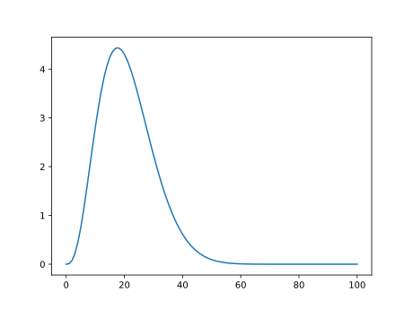
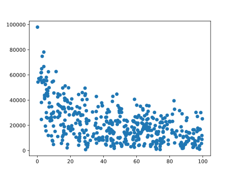

Something I have played around with a few times before is randomly generating synthetic claims. I used to do this to generate data that I could try my pricing or reserving methods on. Sometimes it is useful to know the underlying distribution of claims when modelling them to see if your methods are working. Also, it is often difficult to find data to try your methods on. That's why we turn to generating synthetic claims.

I thought it would make an interesting blog post to demonstrate how I've normally done this. And, anyone reading can then take the methods and use it for their own interests too.

## Generating a single claim

Let's start simple. Let's say we have sold a single policy to someone to cover their car worth R100,000 against any damage. Say they drove into a pole, a piano fell on it, or someone took a hammer to their car in a fit of rage. Anything can happen.

First, we need to think of how much the claim might be. This should be linked to the value of the car right? Certainly it should. A more expensive car will be more expensive to repair. Makes sense. So a good place to start is a percentage of the value of the car. Let’s say, 20%.

```python
car_value = 100000
claim_proportion = 0.2

cost_of_claim = car_value * claim_proportion
cost_of_claim
```

```
20000.0
```

Great. Blog post done. See you next week.

… But, I know what you are thinking. I am thinking it too. What if a piano fell on my car? Surely the cost of the claim would be much more than if I drove into a pole? I know this because the poles where I live are pretty flimsy, and the pianos are really big. So, we need to think about the distribution of the claim cost. A simple proportion of 20% just won’t cut it.

Let's assume that claims are distributed between 0 and 1 through a Beta distribution. Something like this:

```python
import numpy as np
from scipy.stats import beta
import matplotlib.pyplot as plt

BETA_A = 4
BETA_B = 15

x = np.linspace(0, 1, 101)
plt.plot(beta.pdf(x, a=BETA_A, b=BETA_B))
```



That seems reasonable, right? Most claims will lie around 10-40% of the value of the car. If someone takes a hammer to my car, 10%, if a piano falls on it, at least 40%. So, we can expect a claims cost of around 21% ± 9.1%.

```python
mu, sigma = beta.stats(a=BETA_A, b=BETA_B)
mu, sigma ** 0.5
```

```
(array(0.21052632), 0.0911605688194146)
```

Great, we can now generate a single claim for the policy from the Beta distribution:

```python
beta.rvs(a=BETA_A, b=BETA_B) * car_value
```

```
26024.94354395707
```

Excellent! But the show doesn't stop there. We know that claims can occur multiple times for a single policy. It's terrible, I know. But that's life. Generally, we model the frequency of claims in a given time period using the Poisson distribution. So let’s do exactly that, assuming we expect 0.5 claims to occur per year on this policy on average.

## Generating claims for a single policy for a single year

```python
from scipy.stats import poisson

POISSON_MEAN = 0.5

poisson.rvs(mu=POISSON_MEAN)
```

```
1
```

So, now, for any given year, we can generate the number of claims and the size of each claim:

```python
n_claims = poisson.rvs(POISSON_MEAN)
claim_costs = beta.rvs(a=BETA_A, b=BETA_B, size=n_claims) * car_value

print('Number of claims:', n_claims)
print('Cost of claim(s):', claim_costs)
```

```
Number of claims: 2
Cost of claim(s): [19596.04662656 14093.03568322]
```

Now we are talking. For a given policy we can generate a year of claims experience instantly.

So let's take it a step further. Let’s start a random insurance company.

## Starting a random insurance company

It will be very simple to start. We will accept any policy with a sum insured of R100,000 for a R10,000 annual premium. We will then provide coverage on the policy for 1 year. Also, we only sell on the 1st of January each year. We are cashing in on those new years resolutions.

We will need to define what a policy is. So, lets create a policy class. (If you are unfamiliar with classes in Python, I refer you to this <a href="https://www.hackerearth.com/practice/python/object-oriented-programming/classes-and-objects-i/tutorial/">link</a>.)

```python
class Policy():
    def __init__(self, ID, sum_insured, premium):
        self.ID = ID # Policies need an ID to identify them in a database
        self.sum_insured = sum_insured
        self.premium = premium
        
    def simulate_claims(self):
        self.n_claims = poisson.rvs(mu=POISSON_MEAN) # Generate number of claims
        # Generate claim costs for the n_claims:
        self.claims = {
            claim_id:beta.rvs(a=BETA_A, b=BETA_B, size=1)[0] * self.sum_insured for claim_id, n in enumerate(range(self.n_claims))
        }
```

```python
# Set some constants
SUM_INSURED = 1e5
PREMIUM = 0.1 * SUM_INSURED

p = Policy(1, SUM_INSURED, PREMIUM) # Create a policy object from the policy class

p.simulate_claims()
p.claims
```

```
{0: 39393.27581107701}
```

Creating an object for each policy may seem over-the-top at first. But, it will help us down the line when things get a little bit more complicated.

Now, we can simulate one year at our random insurance company assuming 1,000 people followed through with their new years resolution.

```python
N_POLICIES = 1000

def simulate_company(n_policies):
    # Sell 1000 policies:
    policy_db = {policy_id:Policy(policy_id, SUM_INSURED, PREMIUM) for policy_id in range(N_POLICIES)}

    # Simulate claims for each policy sold
    for policy_id, policy in policy_db.items():
        policy.simulate_claims()
        
    return policy_db

policy_db = simulate_company(N_POLICIES)

policy_db[0].claims # Claims for policy with ID = 0
```

```
{0: 20802.9177064656}
```

Now, our policies are saved in a dictionary, which makes it a little bit difficult to analyse how our company is performing. So let’s make some functions to generate a tabular policy database and claims database.

```python
import pandas as pd

def migrate_policy_db(policy_db):
    
    # Define the columns of the table
    ids = []
    sums_insured = []
    premiums = []
    n_claims = []
    
    # Fetch the values for the columns
    for policy_id, policy in policy_db.items():
        ids.append(policy.ID)
        sums_insured.append(policy.sum_insured)
        premiums.append(policy.premium)
        n_claims.append(policy.n_claims)
        
    # Slap it all into a dataframe
    df = pd.DataFrame({
        'policy_id': ids,
        'sum_insured': sums_insured,
        'premium': premiums,
        'n_claims': n_claims,
    })
    
    return df

policy_df = migrate_policy_db(policy_db)
policy_df
```

<div>
<style scoped>
    .dataframe tbody tr th:only-of-type {
        vertical-align: middle;
    }

    .dataframe tbody tr th {
        vertical-align: top;
    }

    .dataframe thead th {
        text-align: right;
    }
</style>
<table border="1" class="dataframe">
  <thead>
    <tr style="text-align: right;">
      <th></th>
      <th>policy_id</th>
      <th>sum_insured</th>
      <th>premium</th>
      <th>n_claims</th>
    </tr>
  </thead>
  <tbody>
    <tr>
      <th>0</th>
      <td>0</td>
      <td>100000.0</td>
      <td>10000.0</td>
      <td>1</td>
    </tr>
    <tr>
      <th>1</th>
      <td>1</td>
      <td>100000.0</td>
      <td>10000.0</td>
      <td>0</td>
    </tr>
    <tr>
      <th>2</th>
      <td>2</td>
      <td>100000.0</td>
      <td>10000.0</td>
      <td>0</td>
    </tr>
    <tr>
      <th>3</th>
      <td>3</td>
      <td>100000.0</td>
      <td>10000.0</td>
      <td>1</td>
    </tr>
    <tr>
      <th>4</th>
      <td>4</td>
      <td>100000.0</td>
      <td>10000.0</td>
      <td>1</td>
    </tr>
    <tr>
      <th>...</th>
      <td>...</td>
      <td>...</td>
      <td>...</td>
      <td>...</td>
    </tr>
    <tr>
      <th>995</th>
      <td>995</td>
      <td>100000.0</td>
      <td>10000.0</td>
      <td>0</td>
    </tr>
    <tr>
      <th>996</th>
      <td>996</td>
      <td>100000.0</td>
      <td>10000.0</td>
      <td>0</td>
    </tr>
    <tr>
      <th>997</th>
      <td>997</td>
      <td>100000.0</td>
      <td>10000.0</td>
      <td>0</td>
    </tr>
    <tr>
      <th>998</th>
      <td>998</td>
      <td>100000.0</td>
      <td>10000.0</td>
      <td>1</td>
    </tr>
    <tr>
      <th>999</th>
      <td>999</td>
      <td>100000.0</td>
      <td>10000.0</td>
      <td>0</td>
    </tr>
  </tbody>
</table>
<p>1000 rows × 4 columns</p>
</div>


And then, we need a claims database:

```python
def migrate_claims_db(policy_db):
    
    # Define the columns of the table
    policy_ids = []
    claim_ids = []
    claim_costs = []
    
    # Fetch the values for the columns
    for policy_id, policy in policy_db.items():
        for claim_id, claim_cost in policy.claims.items():
            policy_ids.append(policy_id)
            claim_ids.append(claim_id)
            claim_costs.append(claim_cost)
            
    # Slap it all into a dataframe
    df = pd.DataFrame({'policy_id': policy_ids, 'claim_id': claim_ids, 'claim_cost': claim_costs})
            
    return df

claim_df = migrate_claims_db(policy_db)
claim_df
```

<div>
<style scoped>
    .dataframe tbody tr th:only-of-type {
        vertical-align: middle;
    }

    .dataframe tbody tr th {
        vertical-align: top;
    }

    .dataframe thead th {
        text-align: right;
    }
</style>
<table border="1" class="dataframe">
  <thead>
    <tr style="text-align: right;">
      <th></th>
      <th>policy_id</th>
      <th>claim_id</th>
      <th>claim_cost</th>
    </tr>
  </thead>
  <tbody>
    <tr>
      <th>0</th>
      <td>0</td>
      <td>0</td>
      <td>20802.917706</td>
    </tr>
    <tr>
      <th>1</th>
      <td>3</td>
      <td>0</td>
      <td>29255.449074</td>
    </tr>
    <tr>
      <th>2</th>
      <td>4</td>
      <td>0</td>
      <td>20176.285056</td>
    </tr>
    <tr>
      <th>3</th>
      <td>7</td>
      <td>0</td>
      <td>21174.032333</td>
    </tr>
    <tr>
      <th>4</th>
      <td>7</td>
      <td>1</td>
      <td>17948.880595</td>
    </tr>
    <tr>
      <th>...</th>
      <td>...</td>
      <td>...</td>
      <td>...</td>
    </tr>
    <tr>
      <th>520</th>
      <td>986</td>
      <td>1</td>
      <td>28280.526133</td>
    </tr>
    <tr>
      <th>521</th>
      <td>991</td>
      <td>0</td>
      <td>33798.811877</td>
    </tr>
    <tr>
      <th>522</th>
      <td>992</td>
      <td>0</td>
      <td>30009.439916</td>
    </tr>
    <tr>
      <th>523</th>
      <td>993</td>
      <td>0</td>
      <td>5966.436323</td>
    </tr>
    <tr>
      <th>524</th>
      <td>998</td>
      <td>0</td>
      <td>27736.861486</td>
    </tr>
  </tbody>
</table>
<p>525 rows × 3 columns</p>
</div>

So now we have a policy database and a claim database. This means we can then assess our performance as a random insurer for the year (whatever year it is, let's say, 1932).

```python
def underwriting_result(policy_df, claim_df):

    print(f"Gross Written Premium: R {policy_df['premium'].sum():,.2f}")

    print(f"Claims Incurred: R {claim_df['claim_cost'].sum():,.2f}")

    underwriting_result = policy_df['premium'].sum() - claim_df['claim_cost'].sum()

    print(f"Underwriting Profit / Loss: R {underwriting_result:,.2f}")
    
    return

underwriting_result(policy_df, claim_df)
```

```
Gross Written Premium: R 10,000,000.00
Claims Incurred: R 10,951,849.51
Underwriting Profit / Loss: R -951,849.51
```

Looks like we are burning money a bit there. But, we didn't really do much pricing did we? We didn't bother to assess the risk of each policy at all. We just accepted the policy as long as its sum insured was R100,000. Well, in our defence, there wasn't any risk to assess. So I think we did pretty well for a random guess of R10,000. (And yes, it really was a random guess.)

So let's mix things up a bit. Let's complicate matters and add some risk factors. Let's now consider the number of poles near where the car is parked, the distance to the nearest piano factory, and how angry the driver’s ex-partner currently feels (note I said partner, no bias here). These should be good proxies for the main perils we are covering: hitting poles, pianos falling, and crazy ex-partners taking hammers to the car.

To do this, we will re-define our Policy class to take into account these risk factors, and adapt our claims simulations too.

## Adding some risk factors

Let's start with the claims simulator and consider how angry the ex-partner is on a scale of 1 to 3, with 3 being **very** angry, and 1 being only passive-aggressive when you meet them at a bar by chance.

The amount of anger they are feeling will likely impact how long they hammer away at your car for. So, let's create a mapping that alters the severity

```python
ExAngerModifier = {
    1: 0.5,
    2: 1, 
    3: 1.5
}
```

Now, we can alter the parameters of the Beta distribution to take into account the different levels of the risk factor. We will apply this modifier to the beta_a parameter only.

```python
class Policy():
    def __init__(self, ID, sum_insured, premium, ex_partner_anger):
        self.ID = ID
        self.sum_insured = sum_insured
        self.premium = premium
        self.ex_partner_anger = ex_partner_anger
        
    def simulate_claims(self):
        
        beta_a = BETA_A * ExAngerModifier[self.ex_partner_anger] # Modify for anger
        
        self.n_claims = poisson.rvs(mu=POISSON_MEAN)
        self.claims = {
            claim_id:beta.rvs(a=beta_a, b=BETA_B, size=1)[0] * self.sum_insured for claim_id, n in enumerate(range(self.n_claims))
        }
```

Okay, great. Now we can generate claims with a given ex-partner anger level. But now, we need to alter our insurance simulation function to also simulate differing levels of anger for policies:

```python
N_POLICIES = 1000

def simulate_company(n_policies):
    
    anger_levels = np.random.choice([1, 2, 3], size=1000) # Randomly sample an anger level
    
    policy_db = {
        policy_id:Policy(
            policy_id,
            SUM_INSURED,
            PREMIUM,
            ex_partner_anger=anger_levels[policy_id] # And add the anger level
        ) for policy_id in range(N_POLICIES)
    } # Sell 1000 policies

    for policy_id, policy in policy_db.items():
        policy.simulate_claims()
        
    return policy_db

policy_db = simulate_company(N_POLICIES)
```

Next, we migrate the database to get tables for the policies and the claims and assess performance. But, we will also have to add the new column, **ex_partner_anger**, to our policy table.

```python
def migrate_policy_db(policy_db):
    
    ids = []
    sums_insured = []
    premiums = []
    ex_partner_anger = [] # Add it
    n_claims = []
    
    for policy_id, policy in policy_db.items():
        ids.append(policy.ID)
        sums_insured.append(policy.sum_insured)
        premiums.append(policy.premium)
        ex_partner_anger.append(policy.ex_partner_anger) # Add it
        n_claims.append(policy.n_claims)
        
    df = pd.DataFrame({
        'policy_id': ids,
        'sum_insured': sums_insured,
        'premium': premiums,
        'n_claims': n_claims,
        'ex_partner_anger': ex_partner_anger # Add it
    })
    
    return df
```

Now we can create the tables and assess performance again:

```python
policy_df = migrate_policy_db(policy_db)
claim_df = migrate_claims_db(policy_db)

underwriting_result(policy_df, claim_df)
```

```
Gross Written Premium: R 10,000,000.00
Claims Incurred: R 10,707,816.41
Underwriting Profit / Loss: R -707,816.41
```

So we get roughly the same performance, but if we look at the claim cost per anger level we can clearly see that the more anger a policyholder's ex harbors, the more damage they will bring to the poor, poor car.

```python
df = policy_df.merge(claim_df, on='policy_id')

df.groupby('ex_partner_anger')['claim_cost'].mean()
```

```
ex_partner_anger
1    10948.604138
2    20530.531149
3    28888.204265
Name: claim_cost, dtype: float64
```

## Adding even more risk factors

Let's add the last two features (number of poles and distance to piano factory) and then update the required functions to see what we get.

### Number of poles

The more poles there are near where the car is parked, the more frequently a policyholder will hit a pole. So, this risk factor will impact the frequency of claims. Hence, we need to alter the Poisson mean.

We will create a mapping that returns a frequency modifier based on the number of poles, like we did for the ex_partner_anger feature.

```python
NumPolesModifier = {
    '<10': 0.75,
    '10-20': 1,
    '>20': 1.25
}
```

### Distance to nearest piano factory

The closer the policyholder lives to a piano factory, the more frequently pianos will be dropped, and the wider the range of the damage will be. My rock solid logic here is that heavier pianos will be transported shorter distances, and so the closer the policyholder is to a factory, the more severe the damage. (Bear with me here, I am making this up as I go along.)

We will enforce that the relationship between the distance to a piano factory and the frequency follows the inverse square root of the distance, and the severity will follow the square root of the distance, both scaled by 6. Why 6? Why not 6?

```python
def DistanceModifier(distance):
    return 6 / np.sqrt(distance)
```

Okay, lets alter our Policy class again for the new changes:

```python
class Policy():
    def __init__(self, ID, sum_insured, premium, ex_partner_anger, number_poles, factory_distance):
        self.ID = ID
        self.sum_insured = sum_insured
        self.premium = premium
        self.ex_partner_anger = ex_partner_anger
        self.number_poles = number_poles
        self.factory_distance = factory_distance
        
    def simulate_claims(self):
        
        beta_a = BETA_A * ExAngerModifier[self.ex_partner_anger]
        beta_b = BETA_B / DistanceModifier(self.factory_distance) # Smaller BETA_B = larger variance
        
        poisson_mu = POISSON_MEAN * NumPolesModifier[self.number_poles] * DistanceModifier(self.factory_distance)
        
        self.n_claims = poisson.rvs(mu=POISSON_MEAN)
        self.claims = {
            claim_id:beta.rvs(a=beta_a, b=beta_b, size=1)[0] * self.sum_insured for claim_id, n in enumerate(range(self.n_claims))
        }
```

Then, we also have to update our simulation function for the new features:

```python
def simulate_company(n_policies):
    
    anger_levels = np.random.choice([1, 2, 3], size=1000)
    number_poles = np.random.choice(['<10', '10-20', '>20'], size=1000)
    factory_distance = np.random.rand(1000) * 100 # Random distance between 0 and 100
    
    policy_db = {
        policy_id:Policy(
            policy_id,
            SUM_INSURED,
            PREMIUM,
            ex_partner_anger=anger_levels[policy_id],
            number_poles=number_poles[policy_id],
            factory_distance=factory_distance[policy_id],
        ) for policy_id in range(N_POLICIES)
    } # Sell 1000 policies

    for policy_id, policy in policy_db.items():
        policy.simulate_claims()
        
    return policy_db

policy_db = simulate_company(N_POLICIES)
```

And then finally we update our policy database migration for the new fields.

```python
def migrate_policy_db(policy_db):
    
    ids = []
    sums_insured = []
    premiums = []
    ex_partner_anger = []
    number_poles = []
    factory_distance = []
    n_claims = []
    
    for policy_id, policy in policy_db.items():
        ids.append(policy.ID)
        sums_insured.append(policy.sum_insured)
        premiums.append(policy.premium)
        ex_partner_anger.append(policy.ex_partner_anger)
        number_poles.append(policy.number_poles)
        factory_distance.append(policy.factory_distance)
        n_claims.append(policy.n_claims)
        
    df = pd.DataFrame({
        'policy_id': ids,
        'sum_insured': sums_insured,
        'premium': premiums,
        'n_claims': n_claims,
        'ex_partner_anger': ex_partner_anger,
        'number_poles': number_poles,
        'factory_distance': factory_distance,
    })
    
    return df
```

Okay, let's see our new performance!

```python
policy_df = migrate_policy_db(policy_db)
claim_df = migrate_claims_db(policy_db)

underwriting_result(policy_df, claim_df)
```

```
Gross Written Premium: R 10,000,000.00
Claims Incurred: R 9,876,541.08
Underwriting Profit / Loss: R 123,458.92
```

Hey, a profit! Some years are quite good for a random insurer. Let’s now analyse each new feature to see if our relationships appear.

```python
df = policy_df.merge(claim_df, on='policy_id')

df.groupby(['ex_partner_anger'])['claim_cost'].mean()
```

```
ex_partner_anger
1    11730.675331
2    22956.222703
3    31291.235193
Name: claim_cost, dtype: float64
```

As we expected, policyholders with angrier ex's have higher average claim costs. No surprises. But, do not that the amounts are a little bit off our base modifier; this is because of the other modifiers.

```python
df = policy_df.merge(claim_df, on='policy_id')

df.groupby(['number_poles'])['n_claims'].mean()
```

```
number_poles
10-20    1.571429
<10      1.483146
>20      1.406504
Name: n_claims, dtype: float64
```

This one is interesting, we said that more poles = more claims, right? But we aren't seeing that clearly here. In fact, our middle range has the least. This is because our frequency is being confounded by another risk factor: the distance to a piano factory.

```python
plt.scatter(x='factory_distance', y = 'claim_cost', data=df)
```



Here, we can clearly see how the closer the policyholder is to a piano factory, the higher the claims and the more variable they are too.

## This is cool, but what's the point?

So, what we have done is built a way to generate claims following a known distribution. This can be super useful when learning how to apply machine learning techniques, or even basic actuarial techniques. Think about fitting a GLM to this data. You would expect to see these relationships come out in the coefficients right? You'd expect the relationship between claim cost and anger level to be positive, similarly, you'd expect the relationship between frequency and number of poles to be positive too. What do you expect of the coefficient for the distance to a piano factory?

What do you think the next steps should be? Maybe:

- Randomly generate sums insured
- Add interaction effects (Maybe a super angry ex drops a piano on the car!?)
- Allow different sale dates and hence change the Poisson parameter

In a future, post, I might explore pricing the data we have generated here a bit more, and expand things. But for now, I thought it would be interesting to show how I have historically played around with generating claims to understanding risk factors and pricing a bit better. I hope you enjoyed a bit of a less serious take on what might appear a boring subject to some!